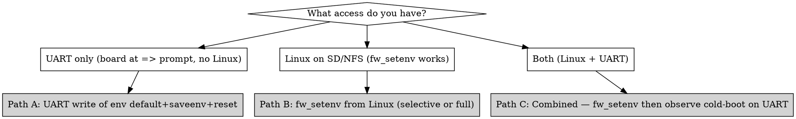

# Recovering a Board's U-Boot SPI Env State

## Why SPI env breaks

When `CONFIG_ENV_IS_IN_SPI_FLASH=y` (rock-5b ships this on edge/v2026.04),
U-Boot reads its environment from SPI on every boot. The semantics are
critical: **a valid-CRC SPI env REPLACES the compile-time
`default_environment[]`; it does not merge with it.**

Practical consequence: the first successful `fw_setenv` from Linux (or
`saveenv` from the U-Boot prompt) "freezes" whatever subset of vars
happened to be in the runtime env at that moment. Any compile-time
default that wasn't explicitly carried forward is dropped — and U-Boot
now reads SPI as the source of truth, so those defaults are gone on the
next boot.

The two failure modes this produces:

1. **No `bootcmd` in SPI** — the SPI env was written without preserving
   the compile-time `bootcmd`. U-Boot autoboot has nothing to run, so
   the SPL trace shows `Net: eth0: ...` followed immediately by `=>`
   with no `Hit any key to stop autoboot` countdown in between.

2. **PXE addresses vanished** — `pxefile_addr_r`, `kernel_addr_r`,
   `ramdisk_addr_r`, `fdt_addr_r` were stripped from SPI. U-Boot's PXE
   bootmeth checks `env_get_hex("pxefile_addr_r", 0)` and silently
   bails on 0, so `bootflow scan` finds 0 bootflows on the ethernet
   bootdev despite the NIC being up. See
   `docs/uboot-armbian-build-explainer.html` §8.2.

## When to invoke this skill

Diagnostic signatures (any one is enough):

- SPL trace shows `Net:   eth0: ...` immediately followed by `=>` with
  no `Hit any key` countdown line in between.
- `bootflow scan -l` returns 0 bootflows on a board whose NIC is
  enumerated.
- `fw_printenv bootcmd` returns nothing (or `## Error: "bootcmd" not defined`).
- `fw_printenv pxefile_addr_r` is empty on a `CONFIG_ENV_IS_IN_SPI_FLASH=y` board.
- Operator ran `fw_setenv` or `saveenv` in a prior session and cold-boot
  behaviour regressed afterwards.

**Not this skill:**

- Board is powered off → just power it up.
- Board is up but SSH fails → check `armbian_default_password` and run
  `bootstrap_armbian.yml`. SPI env is not the issue.
- Board boots fine but PXE fails → check rb5009 TFTP rules
  (`/ip tftp print where req-filename~"<mac>"`). SPI env is OK.
- Board cold-boots to autoboot but stops at U-Boot because operator hit
  a key during the countdown → just send `boot` over UART.

## Three recovery paths by access level

Pick the path that matches what you can currently do with the board:



### Path A — UART only (board stuck at `=>`)

The board can't boot Linux, so `fw_setenv` is unavailable. Drive U-Boot
directly over UART.

**Pre-flight:** confirm you have a writable UART path. The
`testing-armbian-board-hardware` skill's Phase 0 covers the serial
probe; the `/dev/ttyUSB0` permissions need to allow writes (typically
`crw-rw-rw-` on bind-mount; otherwise `sudo`).

```bash
# Configure line discipline (rock-5b Rockchip default; adjust per SoC)
sudo stty -F /dev/ttyUSB0 1500000 cs8 -cstopb -parenb -ixon -crtscts raw

# Reset env to compile-time defaults, save to SPI, reboot.
# Chained with \r separators — U-Boot CLI processes one command per CR.
printf 'env default -a -f\rsaveenv\rreset\r' > /dev/ttyUSB0
```

**Watch the serial trace for confirmation:**

- `## Resetting to default environment` → `env default -a -f` ran.
- `Saving Environment to SPIFlash... Erasing... Writing... done OK` → persisted.
- A fresh `U-Boot SPL` line ≥5s later → `reset` fired.

**Gotcha:** `reset` can be lost if it arrives at the U-Boot CLI while
`saveenv` is still erasing/writing SPI. Symptom: `=>` reappears but no
SPL output follows within ~10s. Resend `reset` (idempotent — board is
already at the prompt):

```bash
printf 'reset\r' > /dev/ttyUSB0
```

After the reboot, the board should autoboot per its U-Boot binary's
compile-time `bootcmd` — typically SD/`boot.scr` for Armbian images.
From here, if you're chasing autonomous PXE, run
`persist_uboot_env.yml` (Path B/C) to layer the PXE-related vars back
on top of defaults.

### Path B — Linux on the board (SD or NFS), `fw_setenv` works

The board is reachable on SSH but its SPI env is missing critical vars.
Three sub-paths in order of preference.

#### B.1 — Use the collection's persist playbook (preferred)

If a `persist_uboot_env.yml`-style playbook ships for this board
(rock-5b currently), use it. It drift-detects each desired var,
snapshots before mutating, and writes only what differs:

```bash
ansible-playbook playbooks/persist_uboot_env.yml --limit <board>
```

See the playbook header for prerequisites (`bootstrap_armbian` done,
`armbian_board_mac` set in inventory).

#### B.2 — Manual `fw_setenv` (ad-hoc, or boards without a persist playbook)

```bash
# Verify SPI layout matches /etc/fw_env.config first — wrong offsets corrupt env.
ssh <board> 'cat /etc/fw_env.config'
# rock-5b expected: /dev/mtd0    0xc00000    0x20000    0x1000

# Snapshot before mutating (recovery hatch)
ssh <board> 'sudo fw_printenv > /var/backups/uboot-env-recovery-$(date -u +%Y%m%dT%H%M%S).bak'

# Restore the standard set (rock-5b mainline u-boot defaults + inventory MAC)
ssh <board> "sudo bash -c '
  fw_setenv pxefile_addr_r 0x00500000
  fw_setenv kernel_addr_r  0x02080000
  fw_setenv ramdisk_addr_r 0x06000000
  fw_setenv fdt_addr_r     0x08000000
  fw_setenv scriptaddr     0x00c00000
  fw_setenv bootmeths      \"pxe extlinux script efi\"
  fw_setenv ethaddr        <inventory MAC, lowercase>
'"
```

#### B.3 — Restore from snapshot

If a prior `persist_uboot_env.yml` run left a `.bak`:

```bash
ssh <board> 'ls /var/backups/uboot-env-*.bak'
# Pick the snapshot from before the bad mutation. Each .bak is the literal
# fw_printenv output, one `key=value` per line.
ssh <board> 'sudo cat /var/backups/uboot-env-<iso8601>.bak \
  | while IFS== read -r k v; do sudo fw_setenv "$k" "$v"; done'
```

**After any B path** — cold-cycle the board (PoE or PSU). Warm `reboot`
may not re-read SPI on some RK3588 boot ROMs. The next boot will read
the updated SPI env. `persist_uboot_env.yml`'s built-in cold-cycle
handler does this automatically when run with default tags against a
PoE-wired board.

### Path C — Both Linux and UART access

You have the highest-leverage position. Use `fw_setenv` (or
`persist_uboot_env.yml`) to set the env *and* observe the cold-boot
trace on UART to confirm the new vars actually drove the boot.

```bash
# Linux side — apply env changes without internal cold-cycle
ansible-playbook playbooks/persist_uboot_env.yml --limit <board> --skip-tags cold_cycle

# Start serial capture (kill any stale socat first — see testing skill Phase 0)
sudo stty -F /dev/ttyUSB0 1500000 raw
socat -u /dev/ttyUSB0,b1500000,raw,echo=0 OPEN:/tmp/recovery-cycle.log,append &

# Cold-cycle (manual PSU unplug+replug, or `ansible -m community.routeros.command`
# against armbian_poe_switch to toggle ether<N>) — your choice depends on power axis

# Inspect the boot trace
LC_ALL=C tr -c '\11\12\15\40-\176' '?' < /tmp/recovery-cycle.log \
  | sed -E 's/\?\[[0-9;]*m//g' \
  | grep -E "Hit any key|Loading Environment|=>|bootflow scan|DHCP client"
```

The presence of `Hit any key to stop autoboot: N` confirms `bootcmd` is
back. The presence of `bootflow scan ... eth_rtl8169.bootdev` followed
by a TFTP fetch confirms the PXE address vars are honoured.

## Diagnostic checks

Run from Linux on the board (Path B/C accessible):

```bash
# Are critical vars present?
sudo fw_printenv | grep -E "^(bootcmd|bootmeths|ethaddr|pxefile_addr_r|kernel_addr_r|ramdisk_addr_r|fdt_addr_r|scriptaddr)="

# What does fw think the SPI layout is?
cat /etc/fw_env.config

# Compare against compile-time defaults extracted from the U-Boot binary
# (one-off — gives the ground truth for what should be in SPI by default)
strings /usr/lib/linux-u-boot-edge-rock-5b/u-boot.itb \
  | grep -E "^(pxefile|kernel|ramdisk|fdt|scriptaddr|bootcmd|bootmeths)="
```

## Common mistakes

| Mistake | Cost | Avoid by |
|---|---|---|
| `printf '...\r' > /dev/ttyUSB0` without configuring `stty` first | UART runs at the wrong baud or buffered mode; U-Boot ignores the input | Always `sudo stty -F /dev/ttyUSB0 <baud> raw` first |
| Chaining `saveenv` and `reset` too tight (no delay) | `reset` gets lost while SPI is still being written; board sits at `=>` | Resend `reset` (it's idempotent), or insert `sleep 2` between commands |
| Editing `/etc/fw_env.config` to "fix" a missing env var | Corrupts SPI on next `fw_setenv` because the layout no longer matches the U-Boot binary | `/etc/fw_env.config` describes the SPI layout, not the env contents — leave as the collection ships it |
| Assuming warm `reboot` re-reads SPI env | Some RK3588 boot ROMs skip SPI re-read on warm boot; new vars don't take effect until cold-cycle | Cold-cycle (PoE off→on or PSU unplug+replug). `persist_uboot_env.yml`'s handler does this by default |
| `env default` without `-a -f` flags | Partial reset that leaves user-overrides intact | Use exactly `env default -a -f` over UART; `-a` = all, `-f` = force-override |
| `fw_setenv <var> ""` to "clear" a var | Writes an empty string, not "absent" — different from compile-time default | To restore a single var to its default, run `fw_setenv <var>` with NO value argument; for full reset use Path A |
| Reflashing the SD as a "recovery" | Doesn't touch SPI — env state persists across SD swaps | SPI lives on the board, not the SD. Use one of A/B/C |

## Cross-references

- `playbooks/persist_uboot_env.yml` — productionised `fw_setenv` flow
  for rock-5b (Approach B from the explainer); preferred Path B.1 entry
  point.
- `docs/uboot-armbian-build-explainer.html` §8 — three-layer PXE
  failure model + Approach A/B framing; §8.2 covers the SPI env
  REPLACE-not-merge semantics in detail.
- `testing-armbian-board-hardware` skill — campaign skill that owns
  Phase 0 rig discovery and iter execution; invoke this skill from
  that skill's Phase 1.5 (board precondition probe) when SPI env is
  the diagnosed issue.
- U-Boot upstream sources for reference: `env/env.c` for
  REPLACE-not-merge semantics; `cmd/nvedit.c` for `env default -a -f`
  behaviour.
