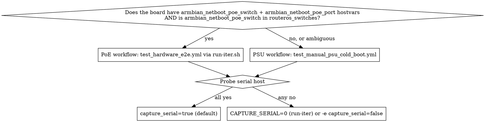
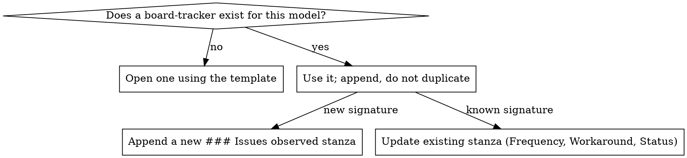

# Testing an Armbian Board's Hardware/Firmware

## Overview

Hardware reliability work is campaign-shaped, not one-shot. A single
e2e run rarely reveals anything; you iterate across PoE-drain
settings, image versions, and SD cards while pinning every run to a
per-iter directory and a GitHub `board-tracker` issue. That issue is
the durable home for serial signatures, frequencies, and workarounds
— the next operator hitting a familiar `Card did not respond to
voltage select! : -110` should GitHub-search it and skip the
rediscovery.

**Core principle:** every iteration produces a comment with config +
PLAY RECAP + e2e log + serial trace. Distinct failure modes become
sub-sections of the tracker issue body. Don't open new issues for
variants of an existing signature.

## When to use

- Onboarding a new board past `stage_netboot_assets.yml` / `stage_router.yml` and running first hardware E2E (see also the `adding-armbian-board` skill).
- An existing board has regressed (kernel bump, image rebuild, environment change).
- Debugging intermittents: PoE cold-boot flakes, PXE silent failures, SD voltage-select.
- Maintaining the tracker (new signature, workaround landed, status change).

## Phase 0 — Discover the test rig (do this before anything else)

Two axes vary per board: **power-cycling mechanism** (PoE switch vs.
manual PSU) and **serial UART availability** (FTDI dongle wired vs.
not). The right playbook + flags depend on both. Probe inventory and
the serial host before committing to a workflow:



### PoE probe

```bash
# Does inventory declare a PoE port for this board?
ansible-inventory --host <board> --list 2>/dev/null \
  | jq -er '. | {armbian_netboot_poe_switch, armbian_netboot_poe_port}'
# Is the named switch in routeros_switches?
ansible-inventory --list 2>/dev/null \
  | jq -er --arg s "<armbian_netboot_poe_switch>" '.routeros_switches.hosts | index($s) != null'
# Confirm the switch is reachable on its network_cli connection
ansible <armbian_netboot_poe_switch> -m community.routeros.command -a 'commands="/system identity print"' 2>&1 | tail -5
```

**Decision:**
- All three pass → **PoE workflow** (`run-iter.sh` → `test_hardware_e2e.yml`).
- Any fail → **PSU workflow** (`test_manual_psu_cold_boot.yml`), or fix inventory if the operator says the board IS PoE-powered.
- Ambiguous (e.g. hostvars say PoE but the switch is unreachable) → **ask the operator** before guessing. The PSU playbook works on a PoE-wired board (the port still passes data even with no power delivered), so falling back to it is non-destructive when in doubt.

### Serial probe

```bash
# Is socat installed on the serial host?
ansible <serial_host> -b -m command -a "which socat"
# Does the expected dongle exist?
ansible <serial_host> -b -m stat -a "path=/dev/ttyUSB0"
# Can the connection user sudo without password? (FTDI is root:dialout)
ansible <serial_host> -b -m command -a "stty -F /dev/ttyUSB0 -a" 2>&1 | head -3
```

**Decision:**
- All three pass → run with `capture_serial=true` (the default for both playbooks).
- Any fail → `CAPTURE_SERIAL=0 run-iter.sh ...` or `-e capture_serial=false` for direct invocations. Diagnostics fall back to second-order signals: rb5009 TFTP HITS and DHCP lease class-id (see Phase 4).
- If `/dev/ttyUSB1` (or different number) is the real device, set `-e serial_device=/dev/ttyUSB<n>`. If a different machine holds the dongle, set `-e serial_host=<inventory-host>`.

### Container-vs-host serial host

When the controller (you) runs from inside a container, `/dev/ttyUSB0` can appear in **two places at once**: bind-mounted into the container AND on the host machine. Both share the same physical device. If a socat is running on each side, they fight for incoming bytes and produce split-byte garbage in both logs.

Discover stale captures on **both sides** before starting your own:

```bash
# Container side — scan /proc (pgrep/ps may be unavailable in stripped images)
for p in /proc/[0-9]*/cmdline; do
  c=$(tr '\0' ' ' < "$p" 2>/dev/null)
  echo "$c" | grep -qE "socat.*ttyUSB|ssh.*socat.*ttyUSB" && echo "$p: $c"
done

# Host side — if you can ssh out from the container
ansible <host> -m shell -a "pgrep -af 'socat.*ttyUSB' || echo no-stale-socat"
```

A common stale pattern is an `ssh igou@localhost sudo socat -u /dev/ttyUSB0 ... > /tmp/uart-watch.log` tunnel left by a prior session — the socat runs on the host, writes a file the operator may be tailing in a terminal pane. Killing it without warning produces "my capture stopped" confusion. **When you kill a stale tunnel, say so in chat first**, with the file path the operator was likely tailing.

Once cleared, pick one side as the canonical capture:

| Where is `/dev/ttyUSB0` more naturally accessible? | Pick |
|---|---|
| Bind-mounted into the container with `crw-rw-rw-` permissions | Run socat in the container; artifacts under `/tmp/iter-<label>/serial.log` |
| Only on the host (not bind-mounted) | Run socat on the host via ansible delegation; ship the log back with `scp` |

`/tmp/iter-<label>/serial.log` is the canonical path either way — if you captured on the host, scp into the container's iter dir so all evidence lives together.

### When to ask the operator

If any probe is ambiguous (e.g. hostvars missing AND it's not clear whether that's an oversight or a real PSU board; or `/dev/ttyUSB0` exists but the operator is testing a different board on the same dongle), **ask before proceeding**. Concrete prompts:

- "How is `<board>` powered for this campaign — PoE managed via `<switch>:<port>`, or USB-C/wall PSU you'll cycle by hand?"
- "Is a serial UART wired? If yes, which host has the FTDI dongle (`localhost` is the default) and which `/dev/ttyUSB<n>`?"
- "If serial is wired but not on the same machine as the controller, can the connection user reach the dongle with passwordless sudo?"
- "When I'm running in a container with `/dev/ttyUSB0` bind-mounted, is there also a host-side capture I should know about (e.g. `tail -f /tmp/uart-watch.log`)?"

Don't proceed past Phase 0 until both axes are pinned down — running the wrong playbook wastes an iteration slot and produces a misleading PLAY RECAP that obscures the real issue.

## Phase 1 — Tracker issue lifecycle



**Open** (first time for a board model):
```bash
gh issue create \
  --title "[board-tracker] <model>: hardware reliability" \
  --label hardware --label board-tracker \
  --body-file <(sed -n '/^## Board/,$p' .github/ISSUE_TEMPLATE/board-hardware-tracker.md)
```
Fill the `## Board` block (model, vendor, SoC, support tier, armbian/build conf link, onboarding date+PR).

**Append per-failure-mode stanza:** copy the `### <signature>` template — `Symptom / Serial signature / Frequency / Trigger / Impact / Confused-with / Workaround (collection) / Workaround (manual) / Upstream tracking / Status`. **Paste serial signatures verbatim** from `/tmp/iter-<N>/serial-clean.log` — future operators grep on them.

**Find the existing tracker:** `gh issue list --label board-tracker --state all`.

## Phase 1.5 — Board precondition probe (before any Phase 2 iter run)

Phase 0 covered the rig (how power and serial are wired). Phase 1.5 covers the **board's current state**: is it powered, reachable, at a sane boot stage, bootstrapped? Running an iter against a board in an unexpected state wastes the slot and produces misleading PLAY RECAP. Spend 2 minutes here to save 20+ minutes per iter.

Probe in this order — each step has a fast verdict and a routing decision:

### 1. Is the board powered + on the network?

```bash
ansible <armbian_netboot_router> -m community.routeros.command \
  -a 'commands="/ip dhcp-server lease print detail where mac-address=<armbian_netboot_board_mac>"' \
  2>&1 | tail -5
```

| Lease state | Means | Action |
|---|---|---|
| `status=bound last-seen=<N>` with N < 5m | Board is up | Continue to step 2 |
| `status=waiting last-seen=21m31s` (or any long last-seen) | Board off, or NIC unplugged | Ask operator to power up; reprobe in ~60s |
| No matching lease | Inventory MAC wrong, or board never seen | Verify inventory `armbian_netboot_board_mac` matches the physical NIC |

### 2. Is SSH reachable as the inventory user?

```bash
ansible <board> -m ping 2>&1 | tail -5
```

| Result | Means | Action |
|---|---|---|
| `pong` | Linux up + auth works | Continue to step 3 (optional health check) or skip to Phase 2 |
| `Permission denied (publickey,password)` | Linux up but not bootstrapped | Run `bootstrap_armbian.yml` first (may need the fresh-board recipe below) |
| `Connection timed out` | DHCP visible but no Linux sshd | **Capture serial for 10s and classify via step 3** — likely stuck at U-Boot prompt, first-boot setup, or kernel panic |

### 3. Peek serial to classify boot stage

10s of socat against an idle board catches enough state to classify:

```bash
mkdir -p /tmp/precheck && sudo stty -F /dev/ttyUSB0 1500000 raw
timeout 10 socat -u /dev/ttyUSB0,b1500000,raw,echo=0 \
  OPEN:/tmp/precheck/peek.log,append || true
LC_ALL=C tr -c '\11\12\15\40-\176' '?' < /tmp/precheck/peek.log \
  | sed -E 's/\?\[[0-9;]*m//g' | tail -20
```

What you see → what it means → what to do:

| Trace tail | State | Action |
|---|---|---|
| `=>` after `Net: eth0:` with no `Hit any key` countdown anywhere | SPI env damaged (no `bootcmd`) | **Invoke `recovering-uboot-spi-state` (Path A)** before continuing |
| `Hit any key to stop autoboot: N` countdown visible, bootflow output follows | Autoboot working; just hasn't reached Linux yet | Wait 30s; reprobe SSH |
| `Create root password:` or `Please provide a username` | Armbian first-boot setup blocking SSH | Run the **fresh-board recipe** below before bootstrap |
| `Welcome to Armbian` + login prompt, no SSH | Linux up but auth not bootstrapped | Run `bootstrap_armbian.yml --limit <board> -e armbian_netboot_default_password=1234` |
| Silence (empty log after 10s) | Board off, UART unplugged, baud mismatch, or stuck in BL31 | All of power state, UART wiring, and baud rate are suspect — back to Phase 0 |

### Fresh-board first-boot recipe

A freshly-flashed Armbian image auto-logs root on tty1 and then **forces** an interactive password + user-creation flow. Until cleared, neither SSH login nor `bootstrap_armbian.yml` will work. Recipe:

```bash
sudo stty -F /dev/ttyUSB0 1500000 raw
printf '1234\r1234\r' > /dev/ttyUSB0    # set root password to armbian default (entered twice)
sleep 3
printf '\x03' > /dev/ttyUSB0            # Ctrl-C skips "Creating a new user account"
sleep 2
# Confirm: serial should show 'Disabling user account creation procedure' then 'root@<board>:~#'
```

After this, `bootstrap_armbian.yml --limit <board> -e armbian_netboot_default_password=1234` can run, and SSH-as-root with password `1234` works until bootstrap disables password auth in sshd.

### Don't skip 1.5

Each precondition mismatch costs an iter slot — the playbook fails in a confusing way (SSH unreachable, auth denied, or worse: succeeds against a board that's NFS-rooted when you wanted SD-rooted, polluting Phase 1 of the e2e test). Two minutes of probing here is worth the avoidance.

## Phase 2 — Iteration runs

The workflow chosen in Phase 0 dictates the entry point:

### Phase 2A — PoE workflow (`run-iter.sh` → `test_hardware_e2e.yml`)

```bash
# Standard iter (defaults: localhost serial, ttyUSB0, 1500000 baud, issue #38)
playbooks/scripts/run-iter.sh <N> -- -e armbian_netboot_pxe_verbose=true -e armbian_netboot_poe_cycle_delay=30

# Different tracker / different board
ISSUE_NUMBER=59 HOST_LIMIT=rock-5b-01 playbooks/scripts/run-iter.sh <N> -- -e armbian_netboot_poe_cycle_delay=30

# Serial unavailable (Phase 0 serial probe failed)
CAPTURE_SERIAL=0 playbooks/scripts/run-iter.sh <N> -- -e armbian_netboot_poe_cycle_delay=30

# Forensic mode — preserve failure state for manual inspection
playbooks/scripts/run-iter.sh <N> -- -e leave_state=true
```

Each run writes `/tmp/iter-<N>/{meta.txt,e2e.log,serial.log,serial-clean.log,comment.md}` and posts `comment.md` to the tracker. `POST_COMMENT=0` skips the post (iterate locally before publishing). Exit code mirrors ansible-playbook's, so chained runs short-circuit on failure.

**Knob menu** (order = usefulness):
- `armbian_netboot_poe_cycle_delay=<N>` — drain seconds between PoE off and on. RK3588 SD voltage-select flakes drop sharply at ≥20 s.
- `armbian_netboot_pxe_verbose=true` — kernel cmdline + earlycon on serial during PXE boot.
- `armbian_netboot_boot_retry_attempts=<N>` — retry cold-boot intermittency before failing.
- `skip_baseline=true` — skip Phase 1 when local SD boot is broken.
- `leave_state=true` — forensic; no cleanup.
- `_wait_timeout=<sec>` — bump per-phase SSH wait (default 300).

### Phase 2B — PSU workflow (`test_manual_psu_cold_boot.yml`)

For boards powered via USB-C / wall PSU (no `armbian_netboot_poe_switch` in inventory, or the PoE HAT is off the board so the UART is accessible). One **cold boot per run** — the operator is prompted to plug/unplug at each transition. Run-iter.sh doesn't yet wrap this playbook; invoke ansible-playbook directly and capture artifacts manually:

```bash
ITER=<N>; mkdir -p /tmp/iter-${ITER}
ansible-playbook playbooks/test_manual_psu_cold_boot.yml \
  --limit <board> \
  -e armbian_netboot_default_password=1234 \
  -e _serial_log=/tmp/serial-iter-${ITER}.log \
  $( [[ -n "${NO_SERIAL:-}" ]] && echo "-e capture_serial=false" ) \
  2>&1 | tee /tmp/iter-${ITER}/e2e.log

# Slurp serial log + post to tracker manually (mirrors run-iter.sh's body)
scp <serial_host>:/tmp/serial-iter-${ITER}.log /tmp/iter-${ITER}/serial.log
LC_ALL=C tr -c '\11\12\15\40-\176' '?' < /tmp/iter-${ITER}/serial.log \
  | sed -E 's/\?\[[0-9;]*m//g' > /tmp/iter-${ITER}/serial-clean.log
gh issue comment <tracker-issue> --body-file <(
  printf '**Iteration %s** (manual PSU)\n\n```\n' "${ITER}"
  tail -50 /tmp/iter-${ITER}/e2e.log
  printf '\n```\n<details><summary>serial trace</summary>\n\n```\n'
  cat /tmp/iter-${ITER}/serial-clean.log
  printf '\n```\n</details>\n'
)
```

This playbook only exercises the **enable-netboot direction** (PXE→NFS); it doesn't toggle back to disk in the same run. To test the disk-direction toggle, run a second PSU iter with `playbooks/set_boot_mode.yml` with `-e armbian_netboot_boot_mode=sd` substituted in for the pxelinux.cfg write step (or run the e2e harness when PoE comes back).

### Phase 2C — Non-e2e playbook iter pattern (generic wrapper)

For playbooks that aren't the e2e/PSU harnesses but still warrant tracker-anchored evidence — `persist_uboot_env.yml`, ad-hoc `converge_boot_mode.yml` / `set_boot_mode.yml` runs, recoveries via `recovering-uboot-spi-state`. Use this when run-iter.sh doesn't apply but you still want a comment on the tracker that future operators can grep.

**Iter label convention:** `<2-char-prefix><N>` where the prefix identifies the playbook. Reserved/conventional prefixes:

| Prefix | Playbook | Why |
|---|---|---|
| (numeric) | `test_hardware_e2e.yml` via run-iter.sh | Default — preserves run-iter.sh's existing convention |
| `PB` | `persist_uboot_env.yml` | "Persist B" (Approach B from the U-Boot explainer) |
| `EN` | `converge_boot_mode.yml` standalone | "Converge boot mode" |
| `DN` | `set_boot_mode.yml` with `-e armbian_netboot_boot_mode=sd` | "SD boot mode" |
| `RC` | Recovery via `recovering-uboot-spi-state` | "ReCovery" |
| `PS` | `test_manual_psu_cold_boot.yml` | "PSU" — disambiguates from numeric PoE iters |

Example: `iter-PB1` = first `persist_uboot_env` validation iter. Same label in `/tmp/iter-<label>/` and in the tracker comment heading.

**Artifact layout** (mirrors run-iter.sh):

```
/tmp/iter-<label>/
├── meta.txt          # iter label, board, playbook(s), settings, date
├── <playbook>.log    # ansible-playbook output (one per playbook if you chain)
├── serial.log        # raw socat capture
├── serial-clean.log  # control-char + ANSI stripped
└── comment.md        # what you post to the tracker
```

**Run skeleton:**

```bash
LABEL=PB1; mkdir -p /tmp/iter-${LABEL}

# 1. Start serial capture (container or host side per Phase 0)
sudo stty -F /dev/ttyUSB0 1500000 raw
socat -u /dev/ttyUSB0,b1500000,raw,echo=0 OPEN:/tmp/iter-${LABEL}/serial.log,append &

# 2. Run the playbook(s); tee each into the iter dir
ansible-playbook playbooks/persist_uboot_env.yml \
  --limit <board> --skip-tags cold_cycle \
  2>&1 | tee /tmp/iter-${LABEL}/persist.log

# 3. Manual cold-cycle if needed (PSU); wait for boot to complete

# 4. Clean serial for the comment
LC_ALL=C tr -c '\11\12\15\40-\176' '?' < /tmp/iter-${LABEL}/serial.log \
  | sed -E 's/\?\[[0-9;]*m//g; s/\?\[\?[0-9;]*[a-zA-Z]//g' \
  > /tmp/iter-${LABEL}/serial-clean.log

# 5. Compose meta + comment (template below), then post
gh issue comment <tracker> --body-file /tmp/iter-${LABEL}/comment.md
```

**Comment template** (adapt headings to your playbook's natural evidence shape):

```markdown
**Iteration <LABEL> — <one-line description>** (YYYY-MM-DD ~HH:MM UTC)

## Outcome
✅ / ❌ / ⚠️ <one-sentence verdict>

## Settings
... iter label, board, playbook(s), key flags, power axis, serial path ...

## Caveats / preconditions
... e.g. SPI env had to be recovered first; v2026.04 working-tree only ...

## PLAY RECAP(s)
... one block per chained playbook ...

## Decisive evidence
... verbatim serial signatures from serial-clean.log, fenced blocks ...
... rb5009 TFTP HITS deltas, DHCP lease state, etc. ...

## Status updates for the tracker body
... what stanzas to mark Mitigated/Resolved; what new signature emerged ...
```

Distinct from Phase 2A (PoE/run-iter.sh) and Phase 2B (PSU manual): Phase 2C makes no assumptions about playbook shape — it's the pattern for arbitrary evidence-gathering runs.

## Phase 3 — Serial capture (when Phase 0 said yes)

**Per-board baud:** Rockchip 1500000; Allwinner 115200; check `vars/boards.yml.console` if unsure. Override with `-e serial_baud=<n>` (and `-e serial_device=/dev/ttyUSB<n>` if not default).

The harness defensively kills leaked prior socats reading the same device before starting a new one — but it only runs that kill when the play reaches the pre-flight serial block. Plays that abort earlier (plumbing-check failure, RouterOS unreachable) can leak a socat; that's caught by the kill on the **next** run.

`serial-clean.log` is the control-char + ANSI-stripped copy posted in the GH comment. Grep across iters: `grep -l "<signature>" /tmp/iter-*/serial-clean.log`. When Phase 0's serial probe said no, both playbooks skip the pre-flight serial block cleanly via `when: capture_serial | bool` and diagnostics fall back to Phase 4's second-order signals.

## Phase 4 — Diagnostic patterns

When e2e fails, check in this order:

1. **PLAY RECAP** in `e2e.log` — which Phase asserted? Phase 1 = disk baseline broken; Phase 2 = PXE/NFS not working; Phase 3 = toggle-off broken.
2. **`/proc/cmdline`** in Phase 2's diagnostic bundle — `nfsroot=` absent ⇒ U-Boot never PXE-booted.
3. **rb5009 TFTP HITS** (on `armbian_netboot_router`): `/ip tftp print where real-filename~"<board>"`. `HITS=0` on per-board pxelinux.cfg ⇒ U-Boot never made a TFTP request (see explainer §8 layers 0/1/2).
4. **Serial trace** — grep for `Card did not respond to voltage select`, `PHY init failed`, `phy not found`, `eth_eqos.*timeout`, `Kernel panic`.
5. **DHCP lease class-id** (rb5009): `/ip dhcp-server lease print detail where mac-address=<armbian_netboot_board_mac>`. `class-id="PXEClient:..."` confirms U-Boot sent a PXE DHCP request; absence ⇒ PXE never tried.

## Phase 5 — Closing the loop

When a signature is fully understood, update its stanza:
- `Status:` → `Mitigated in collection` / `Resolved upstream` / `Hardware-replace-only`.
- `Workaround in this collection:` → file path + commit SHA.
- Promote structural workarounds to the "## Software workarounds active" section (operator no longer needs to think about them).

The tracker issue closes only when **all** stanzas are `Mitigated`/`Resolved`/`Hardware-replace-only` AND the Resolution checklist is ✓. Most board-trackers stay open for the board's life; that's expected.

## Common mistakes

| Mistake | Cost | Avoid by |
|---|---|---|
| Reuse `/tmp/serial-<host>.log` across iters | Settings→output mapping lost; out-of-band traffic clobbers earlier data | Always use `run-iter.sh` — it pins `_serial_log=/tmp/serial-iter-<N>.log` |
| Open a new GH issue per failure mode | Tracker fragmentation; future operator misses related signatures | One board-tracker per model; append `### <signature>` stanzas to the body |
| Skip serial capture because "failure is obvious" | First-order U-Boot/kernel-init failures only surface on serial; e2e log confuses hardware-hang with bootstrap-failure | Capture serial unless physically impossible — then `CAPTURE_SERIAL=0` and rely on rb5009 TFTP HITS as second-order signal |
| Run e2e with stale rb5009 state | Phase 1 accidentally NFS-boots (leftover per-board pxelinux.cfg) and trips the disk-baseline assertion | Pre-flight wipe is in the play; if you SSH'd to rb5009 mid-campaign, restart from clean |
| Paraphrase a serial signature in the tracker | Future grep misses it | Paste verbatim from `serial-clean.log` in a fenced block, with surrounding context lines |
| Run e2e with multiple boards in `--limit` | Pre-flight asserts single-board | Pass `--limit <one-host>`; each board gets its own tracker anyway |
| Forget `armbian_netboot_default_password` before a fresh-flash campaign | Pre-flight assertion fails fast (which is good) but you waste an iter slot | Set in real inventory's `group_vars/all/*.yml` before campaigning |
| Assume PoE without checking inventory | `test_hardware_e2e.yml` pre-flight fails on missing `armbian_netboot_poe_switch`/`armbian_netboot_poe_port`, or `routeros_poe` errors mid-run trying to delegate to a non-RouterOS host | Phase 0 PoE probe first; fall through to `test_manual_psu_cold_boot.yml` when in doubt — it's non-destructive on PoE-wired boards |
| Run with `capture_serial=true` when the dongle is on a different machine | Pre-flight `Serial — assert serial device exists` fails on the wrong host, the campaign aborts before producing useful data | Phase 0 serial probe verifies `serial_host` is reachable AND `/dev/ttyUSB*` exists on **that** host; set `-e serial_host=<other-inventory-host>` or `CAPTURE_SERIAL=0` |
| Board stuck at `=>` with no `Hit any key` countdown in SPL trace | Iter aborts on SSH-unreachable; you waste time debugging the test harness instead of the board | This is **SPI env damage** (CONFIG_ENV_IS_IN_SPI_FLASH semantics — see `recovering-uboot-spi-state` skill). Phase 1.5 catches it; the skill's Path A walks the UART recovery |
| Fresh-flashed board's Armbian first-boot setup blocks SSH | `bootstrap_armbian.yml` times out on SSH unreachable; ansible-ping says "Permission denied" | Phase 1.5 "Fresh-board first-boot recipe" — send `1234\r1234\r` then `\x03` over UART before invoking bootstrap |
| Killing a host-side stale socat silently when controller is in a container | Operator's terminal pane tailing the host's log file goes dark; "my capture stopped" confusion | When you find a stale ssh-tunneled socat (Phase 0 container-vs-host probe), state in chat what you're killing and which log file the operator was likely tailing **before** you kill |
| `printf '...\r' > /dev/ttyUSB0` to drive U-Boot without configuring `stty` first | UART runs at wrong baud or buffered mode; U-Boot ignores the input | Always `sudo stty -F /dev/ttyUSB0 <baud> raw` first. Driving U-Boot directly is covered in detail by `recovering-uboot-spi-state` Path A |

## Quick reference

```bash
# Phase 0 — rig discovery
ansible-inventory --host <board> --list | jq -er '{armbian_netboot_poe_switch, armbian_netboot_poe_port}'
ansible <armbian_netboot_poe_switch> -m community.routeros.command -a 'commands="/system identity print"'
ansible <serial_host> -b -m stat -a "path=/dev/ttyUSB0"
ansible <serial_host> -b -m command -a "which socat"

# Find this board's tracker
gh issue list --label board-tracker --state all

# Run iter against a specific tracker + board
ISSUE_NUMBER=<n> HOST_LIMIT=<host> playbooks/scripts/run-iter.sh <iter> -- <extras>

# Per-iter artifacts
ls /tmp/iter-*/                    # all iters this session
cat /tmp/iter-<N>/meta.txt         # what settings produced this iter

# Grep signatures across iters
grep -l "<signature>" /tmp/iter-*/serial-clean.log

# Confirm U-Boot tried PXE (RouterOS CLI on <armbian_netboot_router>)
/ip tftp print where real-filename~"<board>"
/ip dhcp-server lease print detail where mac-address=<armbian_netboot_board_mac>

# Post a one-off comment (no full iter run)
gh issue comment <N> --body-file /tmp/<file>.md
```

## Cross-references

- `playbooks/test_hardware_e2e.yml` — PoE workflow assertion harness (Phase 1 disk → Phase 2 NFS → Phase 3 disk).
- `playbooks/test_manual_psu_cold_boot.yml` — PSU workflow: operator-paced single cold-boot per run, prompts to plug/unplug PSU at each transition.
- `playbooks/scripts/run-iter.sh` — iter wrapper (artifact dir + GH comment). Currently only wraps the PoE workflow; PSU iterations are operator-driven.
- `playbooks/converge_boot_mode.yml` — converge board(s) to inventory-declared boot mode (pxelinux `default` in the always-netboot model).
- `playbooks/set_boot_mode.yml` — set boot mode ad hoc via `-e armbian_netboot_boot_mode=` (e.g. `sd` or `nfs`).
- `.github/ISSUE_TEMPLATE/board-hardware-tracker.md` — template for new trackers.
- `docs/uboot-armbian-build-explainer.html` §8 — three-layer PXE failure model (diagnostic priors for Phase 2 failures).
- `docs/retry-configuration.md` — recommended knob combinations (healthy / flaky-PoE / max-consistency / fast-iter / fresh-rootfs).
- `docs/superpowers/specs/.rock5b-friction-notes.md` — empirical record of rock-5b bring-up (some mistakes here paraphrase from there).
- `recovering-uboot-spi-state` skill — invoked from Phase 1.5 when the board is stuck at `=>` with no `bootcmd`, or when `fw_setenv` has left SPI in an incomplete state. Covers Path A (UART recovery), Path B (Linux `fw_setenv`), and Path C (combined with serial observation).
