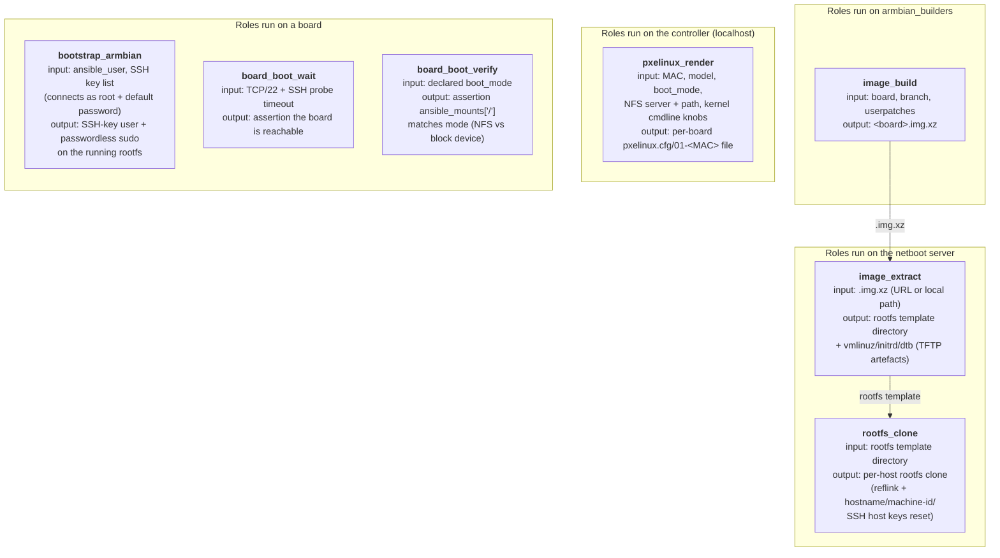
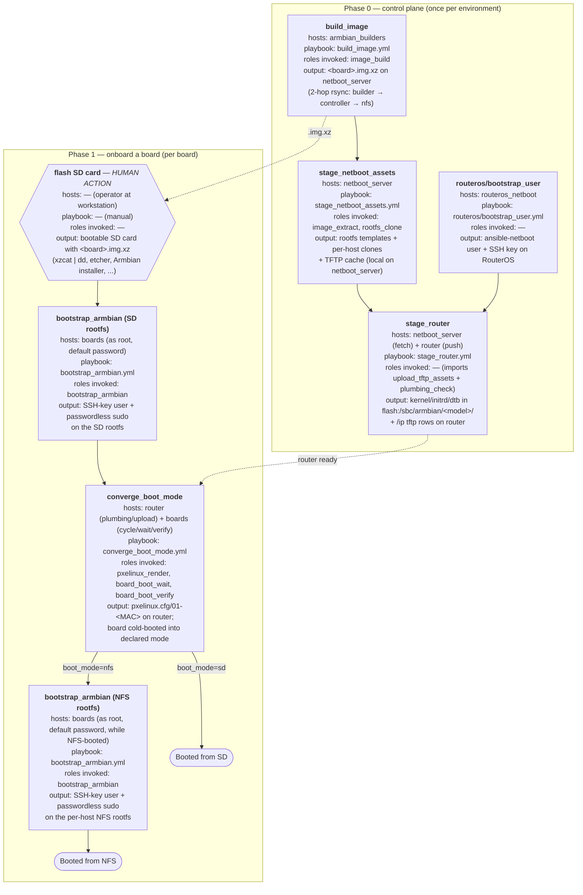
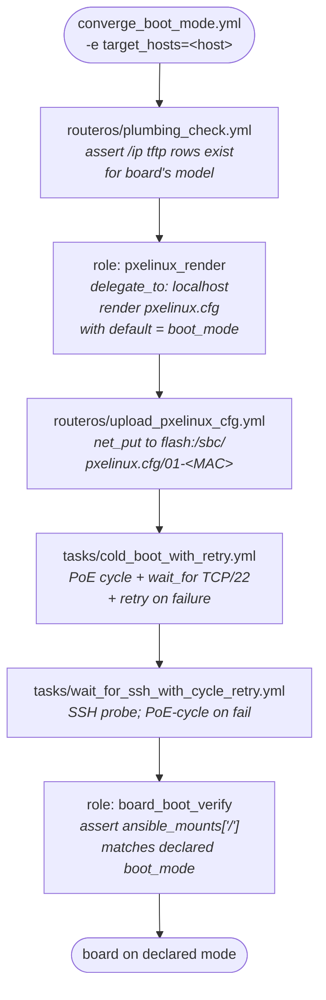
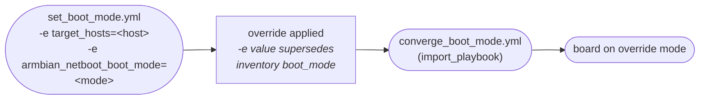
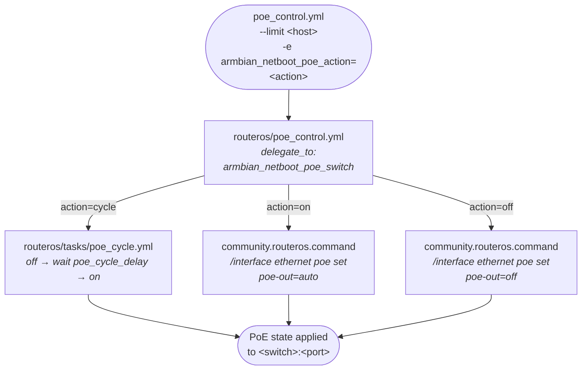
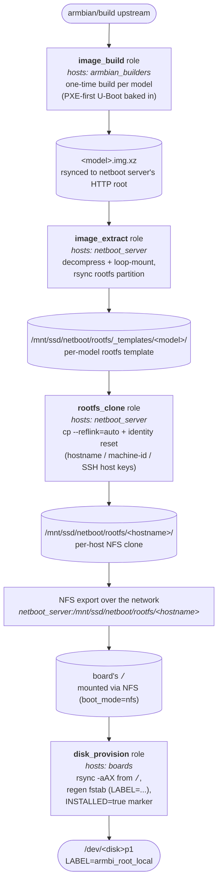

# david_igou.armbian_netboot


Ansible collection (`v3.0.0`) for managing Armbian-based ARM SBCs end-to-end:
build a custom Armbian image with PXE-first U-Boot, stage NFS rootfs templates
and per-host clones on a netboot server, push per-model kernel/initrd/dtb plus
per-board `pxelinux.cfg/01-<MAC>` files to a MikroTik rb5009, then flip each
board between SD and NFS rootfs by editing one `default` directive in its
pxelinux.cfg. Roles are single-purpose state enforcers; playbooks compose them
into workflows. RouterOS-specific behaviour lives in swappable reference
playbooks under [`playbooks/routeros/`](playbooks/routeros/).

## Quickstart

### 1. Install

```bash
ansible-galaxy collection install david_igou.armbian_netboot
```

Or in a `requirements.yml`:

```yaml
---
collections:
  - name: david_igou.armbian_netboot
```

### 2. External prerequisites

Before any playbook runs, the following must already be true in your environment:

- **Netboot server** reachable over SSH (`become: true`), with an NFS export
  for per-host rootfs trees (default: `/mnt/ssd/netboot/rootfs`) and an HTTP
  assets root for serving `.img.xz` artifacts (default:
  `/mnt/ssd/public/boot-files`). The collection creates `_templates/<model>/`
  and `<inventory_hostname>/` subtrees inside the NFS root. See
  [`docs/architecture.md`](docs/architecture.md).
- **MikroTik rb5009 (or equivalent RouterOS device)** reachable via
  `ansible.netcommon.network_cli`. The SBC subnet's DHCP `next-server` must
  point at this device — that DHCP config is owned externally (typically by
  your RouterOS-config repo) and is not asserted by this collection. See
  [`docs/routeros-setup.md`](docs/routeros-setup.md).
- **Docker-capable build host** in the `armbian_builders` inventory group —
  only needed if you build your own images. Pre-built images can be served
  directly from the netboot server's HTTP root.
- **Inventory** that declares per-board `armbian_netboot_board_mac`,
  `armbian_netboot_board_model`, `armbian_netboot_boot_mode`, plus
  `armbian_netboot_poe_switch` / `armbian_netboot_poe_port` for PoE-powered
  boards. The `armbian_netboot_board_model` value must match a key under
  `armbian_netboot_board_configs` in [`vars/boards.yml`](vars/boards.yml).
  See [`inventory/hosts.yml`](inventory/hosts.yml) for the documentation-only
  example layout.

### 3. First run sequence

Two short paths, depending on whether you're setting up the control plane
for the first time or adding a board to an already-set-up environment.

**One-time control-plane setup** (per environment):

```bash
ansible-galaxy collection install -r requirements.yml
ansible-playbook playbooks/routeros/bootstrap_user.yml -e ansible_user=<existing-admin>   # → §0.2
ansible-playbook playbooks/stage_netboot_assets.yml                                       # → §0.3
ansible-playbook playbooks/stage_router.yml                                               # → §0.4
```

**Adding a board** (repeat per physical board):

```bash
# 1. Flash a custom .img.xz to SD card and power on the board (manual)
# 2. Bootstrap the SSH user
ansible-playbook playbooks/bootstrap_armbian.yml --limit orange-pi-5-pro-01               # → §1.4

# 3. Stage per-host rootfs clone + converge the board to its declared boot mode
ansible-playbook playbooks/stage_netboot_assets.yml                                       # → §1.5
ansible-playbook playbooks/converge_boot_mode.yml -e target_hosts=orange-pi-5-pro-01      # → Daily ops
```

After convergence the board participates in the SD ↔ NFS toggle lifecycle
indefinitely. Phase-numbered section references (§0.2, §1.4, …) link into the
detailed [Lifecycle](#lifecycle) below.

## How it works

The collection exposes seven roles. Each one runs on a specific host class,
takes a small input set, and produces one output. Most roles are
independent — they consume inventory metadata or live-board state, not
artefacts from other roles. The only direct role-to-role chain is **image
production**: `image_build` produces a `.img.xz` that `image_extract`
consumes, and `image_extract`'s rootfs template is the input to
`rootfs_clone`. Everything else either feeds external systems (TFTP / NFS
servers, written by orchestration playbooks like `stage_router.yml`) or
acts on a running board.



`image_extract`'s TFTP artefacts and `pxelinux_render`'s pxelinux.cfg
both leave the role boundary via orchestration playbooks
(`stage_router.yml`, `routeros/upload_pxelinux_cfg.yml`) that `net_put`
them to rb5009. `rootfs_clone`'s output is read directly by the netboot
server's NFS export — no further copy. The three board-side roles are
parameterised by inventory and the live board's state; they don't
participate in the dependency chain.

## Example bootstrapping workflow

A board ships from "fresh SD card" to "boots NFS on demand" in two passes
through a small set of playbooks. Phase 0 sets up the control plane once
per environment; Phase 1 onboards each board, ending in either an
SD-rooted or NFS-rooted boot. Each node lists its target hosts, the
playbook that drives it, the roles it invokes, and the output it produces.
**Human actions use the hexagon shape** (only `flash SD card` in this
lifecycle); automation nodes are rectangles; terminal states are stadiums.
After adding a host to inventory, re-run Phase 0's `stage_netboot_assets`
to provision the per-host rootfs clone before the first `converge_boot_mode`.

Phase 1 branches on the inventory's declared `armbian_netboot_boot_mode`.
The SD rootfs and the per-host NFS rootfs are **separate filesystems**,
each cloned from the upstream Armbian image — neither has the inventory's
`ansible_user` until `bootstrap_armbian` runs against the board while it's
booted into that rootfs. Boards declared `boot_mode: sd` need one
bootstrap run; boards declared `boot_mode: nfs` need a second
`bootstrap_armbian` after the first NFS boot so the NFS rootfs gets the
same user.



Once a board is in either outcome state, daily operations toggle between
them or recover from wedged boards — each playbook gets a detailed
diagram under [Daily operations](#daily-operations) below.

Diagnostic playbooks (`test_hardware_e2e.yml`, `persist_uboot_env.yml`,
`test_manual_psu_cold_boot.yml`) sit outside the standard lifecycle and
run on demand — see the [Playbooks table](#playbooks) for frequency.

### Dependency reference: which playbook composes what

The lifecycle above is the order; this table is the dependency graph.
Every user-facing playbook is one row.

| Playbook | `hosts:` | Composes (roles) | Imports (reference playbooks) |
|---|---|---|---|
| `build_image.yml` | `armbian_builders` | `image_build` | — |
| `bootstrap_armbian.yml` | `boards` (as `root`) | `bootstrap_armbian` | — |
| `routeros/bootstrap_user.yml` | `routeros_netboot` | — (uses `community.routeros.command`) | — |
| `stage_netboot_assets.yml` | `netboot_server` | `image_extract`, `rootfs_clone` | — |
| `stage_router.yml` | `netboot_server` (fetch) → `routeros_routers` (push) | — | `routeros/upload_tftp_assets.yml`, `routeros/plumbing_check.yml` |
| `converge_boot_mode.yml` | `routeros_routers` (plumbing) → `boards` (render + boot) | `pxelinux_render`, `board_boot_wait`, `board_boot_verify` | `routeros/plumbing_check.yml`, `routeros/upload_pxelinux_cfg.yml` |
| `set_boot_mode.yml` | (import wrapper) | — | `converge_boot_mode.yml` |
| `poe_control.yml` | `boards` → `routeros_switches` (delegated) | — | `routeros/poe_control.yml` |
| `persist_uboot_env.yml` | rock-5b boards → switch (delegated) | — | — (uses `routeros/tasks/poe_cycle.yml`) |
| `test_hardware_e2e.yml` | `boards` + router (delegated) + switch (delegated) | exercises all roles transitively | exercises all reference playbooks transitively |
| `test_manual_psu_cold_boot.yml` | `boards` (manual PSU) | — | — |

## Mental model

**Roles are single-purpose, parameter-driven state enforcers. Playbooks
compose them into workflows.**

A role asks: *given these inputs, is the world in the desired state, and if
not, make it so.* It does not decide intent — callers do. A playbook decides
which roles to invoke, against which inventory, with which parameters, in
what order. Roles in v3 are transport-agnostic; switch-ecosystem-specific
tasks (RouterOS upload, PoE control) live as swappable reference playbooks
under [`playbooks/routeros/`](playbooks/routeros/), selected via
`armbian_netboot_*_playbook` variables.

Adding a new external system means adding a role. Adding a new operation
that combines existing primitives means adding a playbook (no role changes).
Swapping to a different switch ecosystem means writing a parallel
`playbooks/<vendor>/` directory and pointing the transport-hook variables
at it.

## Status: v3.0.0 — single-purpose, transport-agnostic roles

Breaking change from v2. The five composite v2 roles (`boot_mode`,
`netboot_assets`, `routeros_pxe_config`, `routeros_poe`,
`bootstrap_routeros_user`) are gone; v3 ships seven single-host,
single-purpose roles with zero RouterOS knowledge. The always-netboot model
carries forward unchanged: every onboarded board always has
`pxelinux.cfg/01-<MAC>` on rb5009, boot mode is controlled by the `default`
directive inside it, and the `sd` label defaults to
`root=LABEL=armbi_root` (override per-host via `armbian_netboot_sd_root`).

Specs: [v3 design](docs/superpowers/specs/2026-05-16-role-refactor-v3-design.md) ·
[v2 always-netboot model](docs/superpowers/specs/2026-05-14-always-netboot-migration-design.md)

## Requirements

- Ansible >= 2.15
- A netboot server (e.g. TrueNAS) reachable over SSH that exports the
  per-host NFS rootfs to the boards. The HTTP assets root defaults match the
  homelab's public nginx container on TrueNAS — host-side path
  `/mnt/ssd/public/boot-files`, reachable at `https://public.igou.systems/boot-files/`.
  Override `armbian_netboot_nfs_assets_export` in `group_vars/all.yml` if you
  serve HTTP from a different path.
- A MikroTik RouterOS rb5009 with SSH access. The collection writes per-board
  `pxelinux.cfg/01-<MAC>` (always present; boot mode via `default`) and per-model
  kernel/initrd/dtb under `flash:/sbc/` (override path segment via
  `armbian_netboot_tftp_flash_dir`, default `sbc`) and registers corresponding
  `/ip tftp` rows; no DHCP option-sets or lease mutations. The SBC subnet's
  `next-server` must already point at rb5009 (owned externally — typically
  by your routeros-config repo).
- A Docker-capable build host (for `build_image.yml`) reachable as the
  `armbian_builders` inventory group.

### Collection dependencies

| Collection | Version |
|---|---|
| `community.routeros` | >= 2.0.0 |
| `ansible.posix` | >= 1.5.0 |
| `ansible.netcommon` | >= 5.0.0 |

## Included content

### Roles

| Role | Runs on | Enforces / produces |
|---|---|---|
| [`image_build`](roles/image_build/) | `armbian_builders` | Custom Armbian `.img.xz` with PXE-first U-Boot baked in; optional SCP publish gated by `armbian_netboot_publish_target` |
| [`image_extract`](roles/image_extract/) | netboot server | One rootfs template + per-model TFTP artefacts (vmlinuz/initrd/board.dtb) from a `.img.xz` (local path or URL) |
| [`rootfs_clone`](roles/rootfs_clone/) | netboot server | Per-host rootfs clone (reflink-copy of a template) with identity reset (hostname / machine-id / SSH host keys) |
| [`pxelinux_render`](roles/pxelinux_render/) | `localhost` (via `delegate_to`) | One `01-<mac>` pxelinux.cfg file in a local directory |
| [`board_boot_wait`](roles/board_boot_wait/) | a board | `wait_for` TCP/22 + `wait_for_connection` SSH (no power knowledge) |
| [`board_boot_verify`](roles/board_boot_verify/) | a board | Asserts `ansible_mounts['/']` matches declared boot mode |
| [`bootstrap_armbian`](roles/bootstrap_armbian/) | a board | SSH-key user with passwordless sudo on a freshly flashed board |
| [`disk_provision`](roles/disk_provision/) | a board | Apply a declarative GPT layout to one block device via `systemd-repart`, rsync `source` rootfs onto it, regenerate `/etc/fstab` (root by `LABEL=`). Idempotent on filesystem label; supports `preserve_on_reprovision: true` per partition for state preservation (e.g. `/var` for k3s). Single-disk contract — multi-disk hosts loop the role. |

### Playbooks

| # | Playbook | Frequency | What it does |
|---|---|---|---|
| 0 | `build_image.yml` | Per board model, on `armbian/build` ref or patch-table change | Builds a custom Armbian `.img.xz` for the target board on the `armbian_builders` host. Optionally publishes to the netboot server's HTTP root when `armbian_netboot_publish_target` is set. |
| 1 | `bootstrap_armbian.yml` | Once per board, right after flashing the custom image | Connects as root with `armbian_netboot_default_password`, creates the inventory's `ansible_user` with passwordless sudo + SSH-key auth, drops Armbian's first-login TUI prompt, disables sshd password auth. |
| 2 | `routeros/bootstrap_user.yml` | Once per RouterOS device | Provisions the `ansible-netboot` SSH user, group, and keys on every host in the `routeros_netboot` group. |
| 3 | `stage_netboot_assets.yml` | Once per environment, then on every inventory change | Against the netboot server: image extraction → per-model rootfs templates → per-host rootfs clones with identity reset. |
| 4 | `stage_router.yml` | After NFS staging or when kernel/initrd/dtb change | Three-play composition: fetch per-model kernel/initrd/DTB from the netboot server to controller cache → push to the router via the transport reference playbook → verify `/ip tftp` rows. |
| 5 | `converge_boot_mode.yml` | Ad-hoc or whenever inventory boot mode changes | Converges each targeted board to its inventory-declared `armbian_netboot_boot_mode` (pre-flight router plumbing check → render pxelinux → upload → cold-boot via PoE → wait + verify). |
| 6 | `set_boot_mode.yml` | Ad-hoc override (`-e armbian_netboot_boot_mode=...`) | Thin `import_playbook` wrapper around `converge_boot_mode.yml`. |
| 7 | `poe_control.yml` | Ad-hoc | Power-cycles, powers off, or powers on a board via its upstream `armbian_netboot_poe_switch`. |
| 8 | `persist_uboot_env.yml` | Once per rock-5b board (rare) | Writes the U-Boot env vars rock-5b needs for autonomous PXE via `fw_setenv` from Linux into SPI. |
| 9 | `provision_local_disk.yml` | Once per board you want to make local-bootable (e.g. NVMe) | Wipes the target disk and rsyncs the board's currently-mounted `/` onto a fresh ext4 partition labeled `armbi_root_local`. Composes the `disk_provision` role; refuses to wipe the disk the board is currently booted from. |
| 10 | `reprovision_to_local.yml` | Once per board (or whenever layout changes) | Headless full-lifecycle: boot board into NFS → loop disk_provision over `armbian_netboot_local_disks` → flip pxelinux to local → verify. Auto-reverts to nfs on local-boot failure with a diagnostic bundle captured. |
| — | `test_hardware_e2e.yml` | Ad-hoc | Hardware regression test: drives a single board through SD → NFS → SD via pxelinux + PoE cycles, asserting `findmnt /` reports the expected source at each transition. |
| — | `test_manual_psu_cold_boot.yml` | Ad-hoc | Same shape as the NFS-mode phase of `test_hardware_e2e.yml`, but for USB-C powered boards where power transitions are operator-driven. |

### RouterOS reference playbooks (swappable)

Every RouterOS-specific behaviour lives in `playbooks/routeros/` and is
selected by the orchestration playbook via an `armbian_netboot_*_playbook`
variable (default in parens). Point that variable at a parallel
`playbooks/<vendor>/` directory to swap transports.

| Playbook | Default consumer | Variable to override |
|---|---|---|
| `routeros/bootstrap_user.yml` | manual one-time | — (run directly) |
| `routeros/upload_pxelinux_cfg.yml` | `converge_boot_mode.yml` | `armbian_netboot_pxelinux_upload_playbook` |
| `routeros/upload_tftp_assets.yml` | `stage_router.yml` | `armbian_netboot_tftp_upload_playbook` |
| `routeros/plumbing_check.yml` | `stage_router.yml`, `converge_boot_mode.yml` | `armbian_netboot_plumbing_check_playbook` |
| `routeros/poe_control.yml` | `poe_control.yml` | `armbian_netboot_poe_control_playbook` |

---

## Lifecycle

### Phase 0 — One-time control-plane setup

Done once per environment, before adding any boards.

#### 0.1 Build (or download) the custom Armbian image

Stock Armbian images do not deliver the PXE-first U-Boot ordering this
collection relies on. Either build the image yourself:

```bash
ansible-galaxy collection install -r requirements.yml
ansible-playbook playbooks/build_image.yml
```

…or place a pre-built `.img.xz` in your netboot server's HTTP assets
directory and point `armbian_netboot_image_urls[<model>]` at it. The
`image_build` role patches `armbian/build`'s `pre_config_uboot_target__<board>_*`
hook to set PXE first in U-Boot's `BOOT_TARGETS`. See
[`docs/uboot-armbian-build-explainer.html`](docs/uboot-armbian-build-explainer.html).

#### 0.2 Provision the RouterOS user

```bash
ansible-playbook playbooks/routeros/bootstrap_user.yml \
  -e ansible_user=<existing-admin>
```

Targets the `routeros_netboot` group (router + any switches). The
`-e ansible_user=...` overrides the inventory-set `ansible-netboot` for
this bootstrap run only — that user does not yet exist on the router. The
playbook idempotently creates the `ansible-netboot` user, group, and SSH
keys. From this point on every other playbook authenticates as
`ansible-netboot`.

#### 0.3 Stage NFS rootfs (netboot server)

```bash
ansible-playbook playbooks/stage_netboot_assets.yml
```

Against the netboot server over SSH: for each unique
`armbian_netboot_board_model` in inventory, the `image_extract` role
downloads (or reads locally) the image, extracts the rootfs into
`armbian_netboot_nfs_rootfs_path/_templates/<model>/`, and emits per-model
TFTP artefacts. For each host, `rootfs_clone` reflink-clones a per-host
rootfs into `armbian_netboot_nfs_rootfs_path/<inventory_hostname>/` and
resets hostname / machine-id / SSH host keys.

#### 0.4 Stage TFTP assets (rb5009)

```bash
ansible-playbook playbooks/stage_router.yml
```

Three plays: fetch kernel/initrd/DTB from the netboot server to the
controller's `armbian_netboot_tftp_cache_dir`, push them to rb5009 via
`routeros/upload_tftp_assets.yml`, then verify `/ip tftp` rows landed via
`routeros/plumbing_check.yml`.

Re-run 0.3–0.4 on inventory or image changes; both are idempotent.

### Phase 1 — Adding a board

Repeated once per physical board.

#### 1.1 Flash the custom Armbian image to an SD card (manual)

Use any tool you like — `xzcat | dd`, `etcher`, the Armbian installer — to
write the `.img.xz` produced by `build_image.yml` (or whichever pre-built
image you put in `armbian_netboot_image_urls[<model>]`) to an SD card. This
is the only step in the lifecycle that this collection does not automate;
everything from here on runs over SSH.

#### 1.2 Insert the SD card and power the board on

The board obtains a DHCP lease and responds to SSH. Default credentials
are `root` / `armbian_netboot_default_password` (1234) until first
interactive login replaces them.

#### 1.3 Add the board to inventory

Edit `inventory/hosts.yml`. Each host needs `armbian_netboot_board_mac`,
`armbian_netboot_board_model`, and `armbian_netboot_boot_mode` (`nfs` or
`sd`). For `sd` mode the rendered kernel cmdline defaults to
`root=LABEL=armbi_root`; override with `armbian_netboot_sd_root` only when
a board has multiple drives carrying that label and the default would be
ambiguous. The board model must match a key under
`armbian_netboot_board_configs` in [`vars/boards.yml`](vars/boards.yml):

```yaml
boards:
  children:
    orange_pi_5_pro:
      hosts:
        orange-pi-5-pro-01:
          ansible_host: 192.168.1.131
          armbian_netboot_board_mac: "aa:bb:cc:dd:ee:11"
          armbian_netboot_board_model: orange-pi-5-pro
          armbian_netboot_boot_mode: nfs
```

Group vars under `inventory/group_vars/boards.yml` must define
`armbian_netboot_router` (the RouterOS host that owns TFTP state for these
boards — typically your rb5009 inventory name).

For PoE-powered boards, also set `armbian_netboot_poe_switch` (inventory
hostname of the RouterOS switch supplying power) and
`armbian_netboot_poe_port` (interface name on that switch, e.g. `ether3`).

#### 1.4 Bootstrap the board's SSH user

```bash
ansible-playbook playbooks/bootstrap_armbian.yml --limit orange-pi-5-pro-01
```

Connects as `root` with `armbian_netboot_default_password`, creates the
inventory's `ansible_user` with passwordless sudo + SSH-key auth, drops
Armbian's first-login TUI prompt, and disables sshd password auth.
Idempotent — a second run is a no-op aside from authorized_keys
reconciliation.

Edit the SSH key list in `inventory/group_vars/all.yml` (see
`armbian_netboot_bootstrap_ssh_keys`) or override via `-e` before first run.

#### 1.5 Re-run staging playbooks

```bash
ansible-playbook playbooks/stage_netboot_assets.yml
ansible-playbook playbooks/stage_router.yml
```

Creates the per-host rootfs clone for the new host. Existing boards are
unaffected; the per-model template extraction step is skipped if it's
already populated.

The board is now **fully onboarded**. It will participate in the
toggle-and-revert lifecycle below indefinitely without further setup.

---

## Daily operations

### Converge a board to its declared boot mode

```bash
ansible-playbook playbooks/converge_boot_mode.yml -e target_hosts=orange-pi-5-pro-01
```

Reads each host's `armbian_netboot_boot_mode` from inventory, renders
`pxelinux.cfg/01-<MAC>` (with `default` pointing at the nfs or sd label),
uploads it to rb5009, ensures the `/ip tftp` row exists, PoE-cycles where
applicable, and verifies the board reaches SSH with the expected rootfs.



### Override boot mode without editing inventory

```bash
ansible-playbook playbooks/set_boot_mode.yml -e target_hosts=orange-pi-5-pro-01 -e armbian_netboot_boot_mode=nfs
ansible-playbook playbooks/set_boot_mode.yml -e target_hosts=orange-pi-5-pro-01 -e armbian_netboot_boot_mode=sd
```

Same convergence mechanics as `converge_boot_mode.yml`, but the desired
mode comes from `-e`. See [`docs/boot-mode-override.md`](docs/boot-mode-override.md)
for the three override methods (inventory, `-e`, U-Boot env).



### Power-cycle a board via PoE

When a board is wedged or unreachable, cycle its upstream RouterOS PoE
switch port instead of pulling cables:

```bash
# Hard power-cycle (off → wait armbian_netboot_poe_cycle_delay seconds → on)
ansible-playbook playbooks/poe_control.yml --limit orange-pi-5-pro-01 -e armbian_netboot_poe_action=cycle

# Power off / on individually
ansible-playbook playbooks/poe_control.yml --limit orange-pi-5-pro-01 -e armbian_netboot_poe_action=off
ansible-playbook playbooks/poe_control.yml --limit orange-pi-5-pro-01 -e armbian_netboot_poe_action=on
```

The play targets `boards` with `gather_facts: false` (boards may be powered
off) and delegates the PoE command to each board's
`armbian_netboot_poe_switch` via `delegate_to`. Use
`-e armbian_netboot_poe_cycle_delay=<seconds>` to override the off→on dwell
(default 5s).



### Reprovision a board's local disk

```bash
# Boot the board into NFS first so `/` is the cleanly-cloned per-host rootfs.
ansible-playbook playbooks/set_boot_mode.yml --limit orange-pi-5-pro-01 -e armbian_netboot_boot_mode=nfs

# Then wipe + materialize that rootfs onto a local block device.
ansible-playbook playbooks/provision_local_disk.yml \
  --limit orange-pi-5-pro-01 \
  -e armbian_netboot_local_disk_device=/dev/nvme0n1
```

The `disk_provision` role's source is hardcoded to the board's running `/` —
so whatever rootfs the board is booted from at the moment is what gets
copied to the disk. The pre-step above (`set_boot_mode=nfs`) is what makes
that `/` be the per-host NFS clone (with hostname, machine-id, and SSH host
keys already reset by `rootfs_clone`) rather than the raw, identity-less SD
rootfs from the flashed image. The playbook will refuse to run if the
target disk is the same device the board is currently booted from.

The full lineage from upstream Armbian to a bootable local partition:



Each layer adds something specific: `image_build` bakes PXE-first U-Boot
into a per-model image; `image_extract` turns the image into a per-model
rootfs template; `rootfs_clone` makes a per-host CoW copy with the right
identity; the NFS mount delivers that rootfs as the board's `/`; and
`disk_provision` materializes the *currently-running* `/` onto a local
block device with a fresh `/etc/fstab` pointing root at `LABEL=<label>`.

If the board had been SD-booted when you ran `provision_local_disk.yml`,
the source would have been the SD's ext4 — essentially the raw flashed
image's rootfs, no identity reset, no per-host customization. Booting into
NFS first is what threads the per-host identity all the way through to
the local disk.

### Headless reprovision to local boot

```bash
ansible-playbook playbooks/reprovision_to_local.yml --limit orange-pi-5-max-01
```

Drives a board from any boot mode to verified local-disk boot in one
command. The board's inventory must define
`armbian_netboot_local_disks` (a list of disk bindings, each with a
declarative `layout` of GPT partitions) and
`armbian_netboot_boot_mode: local`.

Inventory example:

```yaml
armbian_netboot_local_disks:
  - device: /dev/nvme0n1
    wipe: true
    layout:
      - { id: esp,  size: 512MiB, type: esp,   format: vfat, label: armbi_esp,        mount: /boot/efi }
      - { id: boot, size: 1GiB,   type: linux, format: ext4, label: armbi_boot,       mount: /boot }
      - { id: var,  size: 20GiB,  type: var,   format: ext4, label: armbi_var,        mount: /var, preserve_on_reprovision: true }
      - { id: root, size: grow,   type: root,  format: ext4, label: armbi_root_local, mount: / }
```

`preserve_on_reprovision: true` partitions (typically `/var` for k3s state)
are detected by filesystem label and skipped on every re-run. Set
`force: true` on a binding to bypass preserve idempotency.

If the final cold-boot in local mode fails, the playbook captures a
diagnostic bundle (`findmnt`, `/proc/cmdline`, `lsblk`, `journalctl -k`,
last 200 UART lines if `-e capture_serial=true`), then auto-reverts
the board to nfs mode for forensic access. Operator fixes the root
cause and re-runs.

### Hardware E2E test

```bash
ansible-playbook playbooks/test_hardware_e2e.yml --limit orange-pi-5-pro-01
```

Drives a single board through SD → nfsroot → SD via pxelinux boot-mode
changes and PoE cycles, asserting `findmnt /` reports the expected source
at each transition. Diagnostic bundle (cmdline, route, lsblk, U-Boot
version, journal) is emitted at every checkpoint. `-e leave_state=true`
preserves the failure state for forensic debugging. `-e capture_serial=true`
spawns a background socat capture from a USB-UART on the serial host
(defaults to `localhost`, override with `-e serial_host=<inventory-host>`,
`-e serial_device=`, `-e serial_baud=`) and tails the last 200 serial
lines at every checkpoint.

---

## Quick reference

| # | Playbook | Frequency |
|---|---|---|
| 0 | `build_image.yml` | Per `armbian/build` ref or patch-table change |
| 1 | `bootstrap_armbian.yml --limit <host>` | Once per board, right after flashing |
| 2 | `routeros/bootstrap_user.yml -e ansible_user=<existing-admin>` | Once per RouterOS device |
| 3 | `stage_netboot_assets.yml` | NFS templates + per-host rootfs on netboot server |
| 4 | `stage_router.yml` | Kernel/initrd/dtb + plumbing check on rb5009 |
| 5 | `converge_boot_mode.yml -e target_hosts=<host>` | Converge to inventory `armbian_netboot_boot_mode` |
| 6 | `set_boot_mode.yml -e target_hosts=<host> -e armbian_netboot_boot_mode=nfs` (or `=sd`) | Ad-hoc boot mode override |
| 7 | `poe_control.yml --limit <host> -e armbian_netboot_poe_action=cycle` | Ad-hoc PoE power-cycle (`on`/`off`/`cycle`) |
| 8 | `persist_uboot_env.yml --limit rock-5b-01` | Once per rock-5b for autonomous PXE |
| 9 | `provision_local_disk.yml --limit <host> -e armbian_netboot_local_disk_device=/dev/nvme0n1` | Wipe + materialize running `/` onto a local block device |
| 10 | `reprovision_to_local.yml --limit <host>` | Headless reprovision: NFS → local with auto-revert |
| — | `test_hardware_e2e.yml --limit <host>` | Ad-hoc SD ↔ NFS hardware E2E test |

## Testing

[Molecule](https://ansible.readthedocs.io/projects/molecule/) scenarios live in
`extensions/molecule/`. Scenarios use a pluggable provisioner pattern so the
same converge and verify plays can run against either local containers or real
VMs. Set the `PROVISIONER` environment variable to switch (default: `podman`).

| Scenario | Purpose | Provisioner |
|---|---|---|
| `default` | Smoke scaffold — confirms a managed container starts. | podman |
| `rootfs_clone` | Synthetic template + identity-reset verification. | podman |
| `pxelinux_render` | Render in `nfs` / `sd` / verbose modes; assert template body. | podman |
| `image_build` | Real Armbian image build on a KubeVirt VM (heavy). | kubevirt |

Roles intentionally not covered by molecule — `image_extract` (needs
`losetup` in a privileged container; unreliable in CI), `board_boot_wait`
(wraps `wait_for` + `wait_for_connection`), `board_boot_verify` (needs real
PXE/NFS hardware) — are exercised by `playbooks/test_hardware_e2e.yml`. See
[`extensions/molecule/README.md`](extensions/molecule/README.md).

```bash
# Run the default scenario with podman
molecule test -s default

# Converge only (skip destroy)
molecule converge -s default

# Re-run verify against an already-converged instance
molecule verify -s default
```

## Makefile targets

| Target | Description |
|---|---|
| `make install` | Install external collection dependencies from `requirements.yml` |
| `make lint` | Run yamllint and ansible-lint |
| `make yamllint` | Run yamllint on `roles/`, `playbooks/`, `inventory/` |
| `make ansible-lint` | Run ansible-lint on `roles/` and `playbooks/` |
| `make molecule` | Run `molecule test` (override with `SCENARIO=<name>` and/or `PROVISIONER=<name>`) |
| `make molecule-kubevirt` | Run `molecule test` against the KubeVirt provisioner (default `SCENARIO=image_build`) |
| `make test` | Run lint then molecule |
| `make collection-build` | Build the collection tarball |
| `make collection-install` | Build and install the collection locally |
| `make galaxy-import` | Run `galaxy-importer` locally (requires `pip install galaxy-importer`) |
| `make clean` | Remove build artefacts |

## Documentation

- [Architecture and boot flow](docs/architecture.md)
- [Boot mode override methods](docs/boot-mode-override.md)
- [Retry / timeout knob recipes](docs/retry-configuration.md)
- [RouterOS setup guide](docs/routeros-setup.md)
- [U-Boot + armbian/build deep-dive](docs/uboot-armbian-build-explainer.html)
- [v3 role refactor spec](docs/superpowers/specs/2026-05-16-role-refactor-v3-design.md)

## License

GNU General Public License v3.0 or later. See [LICENSE](LICENSE).
