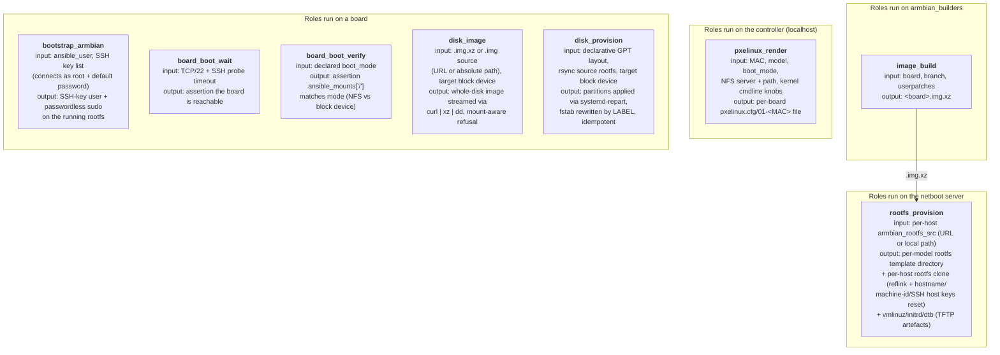

# Architecture and data flow

This page explains how the collection's roles and playbooks fit
together. For the onboarding walkthrough see
[lifecycle.md](lifecycle.md); for day-to-day operations see
[daily-operations.md](daily-operations.md).

## Mental model

> **Roles are single-purpose, parameter-driven state enforcers. Playbooks
> compose them into workflows.**

A role asks: *given these inputs, is the world in the desired state, and
if not, make it so.* It does not decide intent — callers do. A playbook
decides which roles to invoke, against which inventory, with which
parameters, in what order.

Roles are transport-agnostic; switch-ecosystem-specific tasks (RouterOS
upload, PoE control) live as swappable reference playbooks under
[`playbooks/routeros/`](../playbooks/routeros/), selected via
`armbian_*_playbook` variables. Replace the directory to support a
different ecosystem.

- Adding a new external system → add a role.
- Adding a new operation that combines existing primitives → add a
  playbook, no role changes.
- Swapping to a different switch ecosystem → write a parallel
  `playbooks/<vendor>/` directory and point the transport-hook variables
  at it.

## Always-netboot invariant

Every onboarded board always has `pxelinux.cfg/01-<MAC>` on the RouterOS
router. Boot mode is controlled by the `default` directive inside it;
the `sd` label defaults to `root=LABEL=armbi_root` (override per-host
via `armbian_sd_root`). Nothing is added or removed to flip modes —
convergence rewrites the same file.

## How it works

The collection exposes nine roles. Each one runs on a specific host
class, takes a small input set, and produces one output. Most roles are
independent — they consume inventory metadata or live-board state, not
artefacts from other roles. The only direct role-to-role chain is
**image production**: `image_build` produces a `.img.xz` that
`rootfs_provision` consumes (each host resolves its own source via
`_resolve_rootfs_src.yml`, then `rootfs_provision` extracts the template
and clones it per-host). Everything else either feeds external systems
(TFTP / NFS servers, written by orchestration playbooks like
`stage_router.yml`) or acts on a running board.

`rootfs_provision`'s TFTP artefacts and `pxelinux_render`'s pxelinux.cfg
both leave the role boundary via orchestration playbooks
(`stage_router.yml`, `routeros/upload_pxelinux_cfg.yml`) that `net_put`
them to the router. `rootfs_provision`'s per-host clone output is read
directly by the netboot server's NFS export — no further copy. The
board-side roles are parameterised by inventory and the live board's
state; they don't participate in the dependency chain.

## Playbooks

Every user-facing playbook is one row. The lifecycle ordering is the
order they're typically run in
([lifecycle.md](lifecycle.md) walks through Phase 0 + Phase 1 in
detail); this table is the dependency graph.

| # | Playbook | `hosts:` | Composes (roles) | Imports (reference playbooks) |
|---|---|---|---|---|
| 0 | [`build_and_publish_from_inventory.yml`](../playbooks/build_and_publish_from_inventory.yml) | `armbian_builders` | `image_build` | — |
| 1 | [`bootstrap_armbian.yml`](../playbooks/bootstrap_armbian.yml) | `boards` (as `root`) | `bootstrap_armbian` | — |
| 2 | [`routeros/bootstrap_user.yml`](../playbooks/routeros/bootstrap_user.yml) | `routeros_netboot` | — (uses `community.routeros.command`) | — |
| 3 | [`stage_netboot_assets.yml`](../playbooks/stage_netboot_assets.yml) | `netboot_server` | `rootfs_provision` (per host) | — |
| 4 | [`stage_router.yml`](../playbooks/stage_router.yml) | `netboot_server` (fetch) → `routeros_router` (push) | — | `routeros/upload_tftp_assets.yml`, `routeros/plumbing_check.yml` |
| 5 | [`converge_boot_mode.yml`](../playbooks/converge_boot_mode.yml) | `routeros_router` (plumbing) → `boards` (render + boot) | `pxelinux_render`, `board_boot_wait`, `board_boot_verify` | `routeros/plumbing_check.yml`, `routeros/upload_pxelinux_cfg.yml` |
| 6 | [`set_boot_mode.yml`](../playbooks/set_boot_mode.yml) | (import wrapper) | — | `converge_boot_mode.yml` |
| 7 | [`poe_control.yml`](../playbooks/poe_control.yml) | `boards` → `routeros_switch` (delegated) | — | `routeros/poe_control.yml` |
| 8 | [`persist_uboot_env.yml`](../playbooks/persist_uboot_env.yml) | rock-5b boards → switch (delegated) | — | — (uses `routeros/tasks/poe_cycle.yml`) |
| 9 | [`provision_local_disk.yml`](../playbooks/provision_local_disk.yml) | one board | `disk_provision` | — |
| 10 | [`reprovision_to_local.yml`](../playbooks/reprovision_to_local.yml) | one board (+ router delegated) | `pxelinux_render`, `disk_provision`, `board_boot_verify` | `routeros/upload_pxelinux_cfg.yml` |
| — | [`test_hardware_e2e.yml`](../playbooks/tests/test_hardware_e2e.yml) | `boards` + router + switch (delegated) | exercises all roles transitively | exercises all reference playbooks transitively |
| — | [`test_fleet_e2e.yml`](../playbooks/tests/test_fleet_e2e.yml) | `boards` (six-phase fleet harness) | exercises all roles transitively | — |
| — | [`test_manual_psu_cold_boot.yml`](../playbooks/tests/test_manual_psu_cold_boot.yml) | `boards` (manual PSU) | `pxelinux_render`, `board_boot_wait` | — |
| — | [`test_reprovision_e2e.yml`](../playbooks/tests/test_reprovision_e2e.yml) | one board (regression for `reprovision_to_local.yml`) | exercises `disk_provision` lifecycle | — |
| — | [`cleanup_boot_files.yml`](../playbooks/cleanup_boot_files.yml) | `routeros_router` | — | — |

### RouterOS reference playbooks (swappable)

Every RouterOS-specific behaviour lives in
[`playbooks/routeros/`](../playbooks/routeros/) and is selected by the
orchestration playbook via an `armbian_*_playbook` variable. Point that
variable at a parallel `playbooks/<vendor>/` directory to swap
transports.

| Playbook | Default consumer | Variable to override |
|---|---|---|
| `routeros/bootstrap_user.yml` | manual one-time | — (run directly) |
| `routeros/upload_pxelinux_cfg.yml` | `converge_boot_mode.yml` | `armbian_pxelinux_upload_playbook` |
| `routeros/upload_tftp_assets.yml` | `stage_router.yml` | `armbian_tftp_upload_playbook` |
| `routeros/plumbing_check.yml` | `stage_router.yml`, `converge_boot_mode.yml` | `armbian_plumbing_check_playbook` |
| `routeros/poe_control.yml` | `poe_control.yml` | `armbian_poe_control_playbook` |
