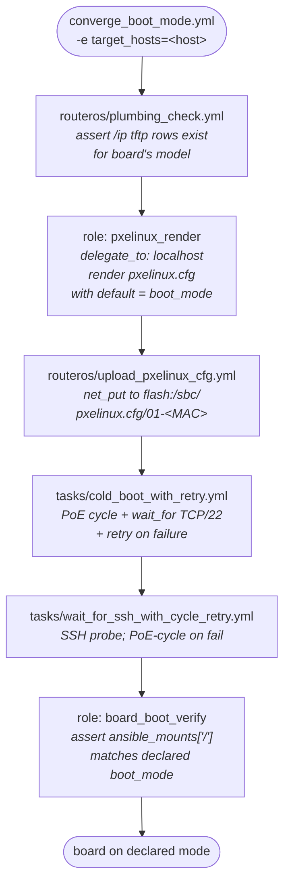
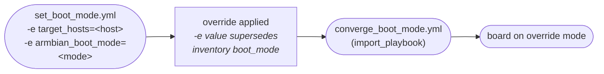
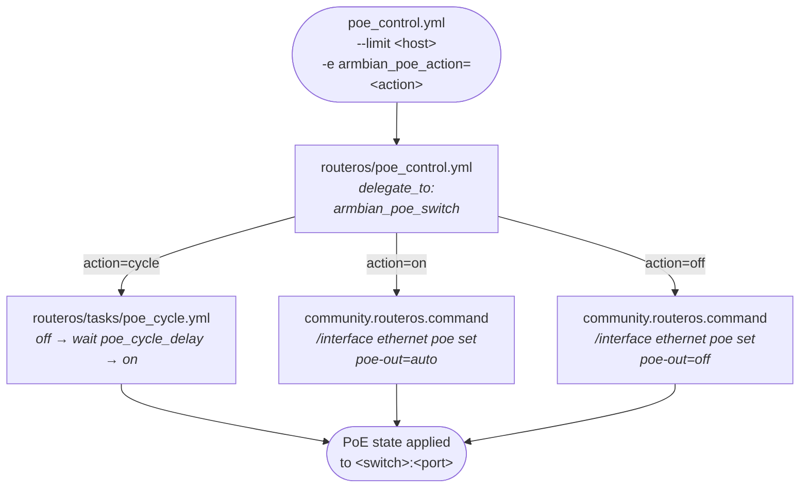
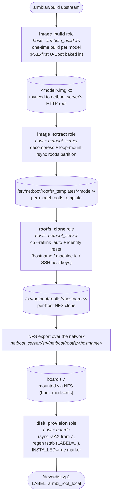

# Daily operations

Day-to-day operations after a board has been onboarded via
[lifecycle.md](lifecycle.md). For the conceptual model see
[architecture.md](architecture.md).

## Converge a board to its declared boot mode

```bash
ansible-playbook playbooks/converge_boot_mode.yml -e target_hosts=orange-pi-5-pro-01
```

Reads each host's `armbian_boot_mode` from inventory, renders
`pxelinux.cfg/01-<MAC>` (with `default` pointing at the nfs or sd
label), uploads it to the router, ensures the `/ip tftp` row exists,
PoE-cycles where applicable, and verifies the board reaches SSH with
the expected rootfs.



## Override boot mode without editing inventory

```bash
ansible-playbook playbooks/set_boot_mode.yml -e target_hosts=orange-pi-5-pro-01 -e armbian_boot_mode=nfs
ansible-playbook playbooks/set_boot_mode.yml -e target_hosts=orange-pi-5-pro-01 -e armbian_boot_mode=sd
```

Same convergence mechanics as `converge_boot_mode.yml`, but the desired
mode comes from `-e`. See
[boot-mode-override.md](boot-mode-override.md) for the three override
methods (inventory, `-e`, U-Boot env).



## Power-cycle a board via PoE

When a board is wedged or unreachable, cycle its upstream RouterOS PoE
switch port instead of pulling cables:

```bash
# Hard power-cycle (off → wait armbian_poe_cycle_delay seconds → on)
ansible-playbook playbooks/poe_control.yml --limit orange-pi-5-pro-01 -e armbian_poe_action=cycle

# Power off / on individually
ansible-playbook playbooks/poe_control.yml --limit orange-pi-5-pro-01 -e armbian_poe_action=off
ansible-playbook playbooks/poe_control.yml --limit orange-pi-5-pro-01 -e armbian_poe_action=on
```

The play targets `boards` with `gather_facts: false` (boards may be
powered off) and delegates the PoE command to each board's
`armbian_poe_switch` via `delegate_to`. Use
`-e armbian_poe_cycle_delay=<seconds>` to override the off→on dwell
(default 5s).



## Reprovision a board's local disk

```bash
# Boot the board into NFS first so `/` is the cleanly-cloned per-host rootfs.
ansible-playbook playbooks/set_boot_mode.yml --limit orange-pi-5-pro-01 -e armbian_boot_mode=nfs

# Then wipe + materialize that rootfs onto a local block device.
ansible-playbook playbooks/provision_local_disk.yml \
  --limit orange-pi-5-pro-01 \
  -e armbian_local_disk_device=/dev/nvme0n1
```

The `disk_provision` role's source is hardcoded to the board's running
`/` — so whatever rootfs the board is booted from at the moment is what
gets copied to the disk. The pre-step above
(`set_boot_mode=nfs`) is what makes that `/` be the per-host NFS clone
(with hostname, machine-id, and SSH host keys already reset by
`rootfs_clone`) rather than the raw, identity-less SD rootfs from the
flashed image. The playbook will refuse to run if the target disk is
the same device the board is currently booted from.

The full lineage from upstream Armbian to a bootable local partition:



Each layer adds something specific: `image_build` bakes PXE-first
U-Boot into a per-model image; `image_extract` turns the image into a
per-model rootfs template; `rootfs_clone` makes a per-host CoW copy
with the right identity; the NFS mount delivers that rootfs as the
board's `/`; and `disk_provision` materializes the *currently-running*
`/` onto a local block device with a fresh `/etc/fstab` pointing root
at `LABEL=<label>`.

If the board had been SD-booted when you ran
`provision_local_disk.yml`, the source would have been the SD's ext4 —
essentially the raw flashed image's rootfs, no identity reset, no
per-host customization. Booting into NFS first is what threads the
per-host identity all the way through to the local disk.

## Headless reprovision to local boot

```bash
ansible-playbook playbooks/reprovision_to_local.yml --limit orange-pi-5-max-01
```

Drives a board from any boot mode to verified local-disk boot in one
command. The board's inventory must define `armbian_local_disks` (a
list of disk bindings, each with a declarative `layout` of GPT
partitions) and `armbian_boot_mode: local`.

Inventory example:

```yaml
armbian_local_disks:
  - device: /dev/nvme0n1
    wipe: true
    layout:
      - { id: esp,  size: 512MiB, type: esp,   format: vfat, label: armbi_esp,        mount: /boot/efi }
      - { id: boot, size: 1GiB,   type: linux, format: ext4, label: armbi_boot,       mount: /boot }
      - { id: var,  size: 20GiB,  type: var,   format: ext4, label: armbi_var,        mount: /var, preserve_on_reprovision: true }
      - { id: root, size: grow,   type: root,  format: ext4, label: armbi_root_local, mount: / }
```

`preserve_on_reprovision: true` partitions (typically `/var` for k3s
state) are detected by filesystem label and skipped on every re-run.
Set `force: true` on a binding to bypass preserve idempotency.

If the final cold-boot in local mode fails, the playbook captures a
diagnostic bundle (`findmnt`, `/proc/cmdline`, `lsblk`,
`journalctl -k`, last 200 UART lines if `-e capture_serial=true`), then
auto-reverts the board to nfs mode for forensic access. Operator fixes
the root cause and re-runs.

See [runbooks/reprovision-local-disk.md](runbooks/reprovision-local-disk.md)
for the full operator runbook: pre-flight checks, what the lifecycle
does play-by-play, environment-specific caveats observed in practice,
failure recovery, and a worked example of changing the layout on an
already-provisioned board.

## `local_kernel` boot mode

Variant of `local` in which the **kernel itself** is loaded from the
NVMe rootfs, not from the router's TFTP. The pxelinux.cfg's
`local_kernel` label has only a `localboot 0` body; U-Boot's `localcmd`
env (baked into the binary by `playbooks/build_and_publish_from_inventory.yml`'s
`__999_orangepi5max_localcmd` hook) runs `bootflow scan -b`, which
hands off to the extlinux bootmeth on the NVMe and follows
`/boot/extlinux/extlinux.conf` (Armbian's standard `apt`-managed boot
path). Selecting this mode means `apt upgrade linux-image-*` on the
board is the kernel update mechanism — no router TFTP refresh, no
per-board module rsync from a central template.

The mode requires a rebuilt image (the `localcmd` value is baked into
U-Boot because boards like the OPi5Max ship `CONFIG_ENV_IS_NOWHERE=y`
and have no persistent env).

## Hardware E2E test

```bash
ansible-playbook playbooks/test_hardware_e2e.yml --limit orange-pi-5-pro-01
```

Drives a single board through SD → nfsroot → SD via pxelinux boot-mode
changes and PoE cycles, asserting `findmnt /` reports the expected
source at each transition. Diagnostic bundle (cmdline, route, lsblk,
U-Boot version, journal) is emitted at every checkpoint.
`-e leave_state=true` preserves the failure state for forensic
debugging. `-e capture_serial=true` spawns a background socat capture
from a USB-UART on the serial host (defaults to `localhost`, override
with `-e serial_host=<inventory-host>`, `-e serial_device=`,
`-e serial_baud=`) and tails the last 200 serial lines at every
checkpoint.

## Fleet-level E2E test

```bash
ansible-playbook playbooks/test_fleet_e2e.yml
```

Deterministic six-phase whole-fleet harness: PoE-down → NFS reset →
NFS boot + bootstrap → dd SD → SD boot + bootstrap → NVMe reprovision
+ local_kernel verify. Used to validate cross-iteration determinism
after image rebuilds or role changes.

## Quick reference

| # | Playbook | Frequency |
|---|---|---|
| 0 | `build_and_publish_from_inventory.yml` | Per `armbian/build` ref or patch-table change |
| 1 | `bootstrap_armbian.yml --limit <host>` | Once per board, right after flashing |
| 2 | `routeros/bootstrap_user.yml -e ansible_user=<existing-admin>` | Once per RouterOS device |
| 3 | `stage_netboot_assets.yml` | NFS templates + per-host rootfs on netboot server |
| 4 | `stage_router.yml` | Kernel/initrd/dtb + plumbing check on the router |
| 5 | `converge_boot_mode.yml -e target_hosts=<host>` | Converge to inventory `armbian_boot_mode` |
| 6 | `set_boot_mode.yml -e target_hosts=<host> -e armbian_boot_mode=nfs` (or `=sd`) | Ad-hoc boot mode override |
| 7 | `poe_control.yml --limit <host> -e armbian_poe_action=cycle` | Ad-hoc PoE power-cycle (`on`/`off`/`cycle`) |
| 8 | `persist_uboot_env.yml --limit rock-5b-01` | Once per rock-5b for autonomous PXE |
| 9 | `provision_local_disk.yml --limit <host> -e armbian_local_disk_device=/dev/nvme0n1` | Wipe + materialize running `/` onto a local block device |
| 10 | `reprovision_to_local.yml --limit <host>` | Headless reprovision: NFS → local with auto-revert |
| — | `test_hardware_e2e.yml --limit <host>` | Ad-hoc SD ↔ NFS hardware E2E test |
| — | `test_fleet_e2e.yml` | Deterministic six-phase whole-fleet harness |
