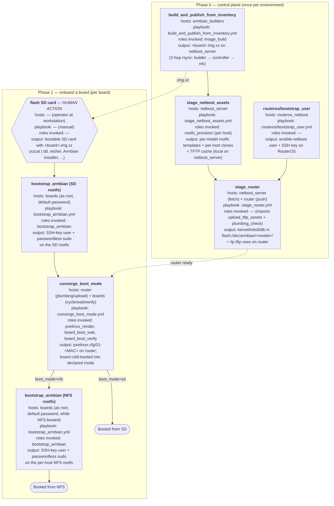

# Lifecycle: Phase 0 (control plane) → Phase 1 (per board)

This page walks through bringing a fresh environment from zero to a
fully onboarded board. For the conceptual model and role / playbook
reference see [architecture.md](architecture.md); for day-to-day
operations see [daily-operations.md](daily-operations.md).

## Overview

A board ships from "fresh SD card" to "boots NFS on demand" in two
passes through a small set of playbooks. Phase 0 sets up the control
plane once per environment; Phase 1 onboards each board, ending in
either an SD-rooted or NFS-rooted boot.

**Human actions use the hexagon shape** (only `flash SD card` in this
lifecycle); automation nodes are rectangles; terminal states are
stadiums. After adding a host to inventory, re-run Phase 0's
`stage_netboot_assets` to provision the per-host rootfs clone before
the first `converge_boot_mode`.

Phase 1 branches on the inventory's declared `armbian_boot_mode`. The
SD rootfs and the per-host NFS rootfs are **separate filesystems**, each
cloned from the upstream Armbian image — neither has the inventory's
`ansible_user` until `bootstrap_armbian` runs against the board while
it's booted into that rootfs. Boards declared `boot_mode: sd` need one
bootstrap run; boards declared `boot_mode: nfs` need a second
`bootstrap_armbian` after the first NFS boot so the NFS rootfs gets the
same user.



Once a board is in either outcome state, daily operations toggle
between them or recover from wedged boards — see
[daily-operations.md](daily-operations.md).

Diagnostic playbooks (`test_hardware_e2e.yml`, `persist_uboot_env.yml`,
`test_manual_psu_cold_boot.yml`) sit outside the standard lifecycle and
run on demand.

## Phase 0 — One-time control-plane setup

Done once per environment, before adding any boards.

### 0.1 Build (or download) the custom Armbian image

Stock Armbian images do not deliver the PXE-first U-Boot ordering this
collection relies on. Either build the image yourself:

```bash
ansible-galaxy collection install -r requirements.yml
ansible-playbook playbooks/build_and_publish_from_inventory.yml
```

…or place a pre-built `.img.xz` in your netboot server's HTTP assets
directory and point `armbian_image_urls[<model>]` at it. The
`image_build` role patches `armbian/build`'s
`pre_config_uboot_target__<board>_*` hook to set PXE first in U-Boot's
`BOOT_TARGETS`.

### 0.2 Provision the RouterOS user

```bash
ansible-playbook playbooks/routeros/bootstrap_user.yml \
  -e ansible_user=<existing-admin>
```

Targets the `routeros_netboot` group (router + any switches). The
`-e ansible_user=...` overrides the inventory-set `ansible-netboot` for
this bootstrap run only — that user does not yet exist on the router.
The playbook idempotently creates the `ansible-netboot` user, group,
and SSH keys. From this point on every other playbook authenticates as
`ansible-netboot`.

### 0.3 Stage NFS rootfs (netboot server)

```bash
ansible-playbook playbooks/stage_netboot_assets.yml
```

Against the netboot server over SSH: for each board host,
`rootfs_provision` resolves the `.img.xz` source (via
`_resolve_rootfs_src.yml`), extracts the rootfs into
`armbian_nfs_rootfs_path/_templates/<model>/` (shared across all hosts of
the same model), and reflink-clones a per-host rootfs into
`armbian_nfs_rootfs_path/<inventory_hostname>/`, resetting hostname /
machine-id / SSH host keys. Per-model TFTP artefacts are also emitted.

### 0.4 Stage TFTP assets on the router

```bash
ansible-playbook playbooks/stage_router.yml
```

Three plays: fetch kernel/initrd/DTB from the netboot server to the
controller's `armbian_tftp_cache_dir`, push them to the router via
`routeros/upload_tftp_assets.yml`, then verify `/ip tftp` rows landed
via `routeros/plumbing_check.yml`.

Re-run 0.3–0.4 on inventory or image changes; both are idempotent.

## Phase 1 — Adding a board

Repeated once per physical board.

### 1.1 Flash the custom Armbian image to an SD card (manual)

Use any tool you like — `xzcat | dd`, `etcher`, the Armbian installer
— to write the `.img.xz` produced by `build_and_publish_from_inventory.yml` (or whichever
pre-built image you put in `armbian_image_urls[<model>]`) to an SD
card. This is the only step in the lifecycle that this collection does
not automate; everything from here on runs over SSH.

### 1.2 Insert the SD card and power the board on

The board obtains a DHCP lease and responds to SSH. Default credentials
are `root` / `armbian_default_password` (1234) until first interactive
login replaces them.

### 1.3 Add the board to inventory

Edit `inventory/hosts.yml`. Each host needs `armbian_board_mac`,
`armbian_board_model`, and `armbian_boot_mode` (`nfs`, `sd`, `local`,
or `local_kernel`). For `sd` mode the rendered kernel cmdline defaults
to `root=LABEL=armbi_root`; override with `armbian_sd_root` only when
a board has multiple drives carrying that label and the default would
be ambiguous. The board model must match an `armbian_board_config_model` entry in the
model group's `inventory/group_vars/<model_group>.yml`:

```yaml
boards:
  children:
    orange_pi_5_pro:
      hosts:
        orange-pi-5-pro-01:
          ansible_host: 192.168.1.131
          armbian_board_mac: "aa:bb:cc:dd:ee:11"
          armbian_board_model: orange-pi-5-pro
          armbian_boot_mode: nfs
```

Group vars under `inventory/group_vars/boards.yml` must define
`armbian_router` (the inventory name of the RouterOS host that owns
TFTP state for these boards).

For PoE-powered boards, also set `armbian_poe_switch` (inventory
hostname of the RouterOS switch supplying power) and
`armbian_poe_port` (interface name on that switch, e.g. `ether3`).

### 1.4 Bootstrap the board's SSH user

```bash
ansible-playbook playbooks/bootstrap_armbian.yml --limit orange-pi-5-pro-01
```

Connects as `root` with `armbian_default_password`, creates the
inventory's `ansible_user` with passwordless sudo + SSH-key auth, drops
Armbian's first-login TUI prompt, and disables sshd password auth.
Idempotent — a second run is a no-op aside from authorized_keys
reconciliation.

Edit the SSH key list in `inventory/group_vars/all.yml` (see
`armbian_bootstrap_ssh_keys`) or override via `-e` before first run.

### 1.5 Re-run staging playbooks

```bash
ansible-playbook playbooks/stage_netboot_assets.yml
ansible-playbook playbooks/stage_router.yml
```

Creates the per-host rootfs clone for the new host via `rootfs_provision`.
Existing boards are unaffected; the per-model template extraction step is
skipped if it's already populated.

The board is now **fully onboarded**. It will participate in the
toggle-and-revert lifecycle in [daily-operations.md](daily-operations.md)
indefinitely without further setup.
